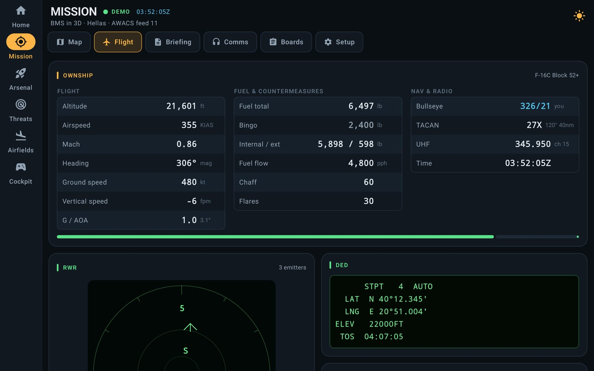
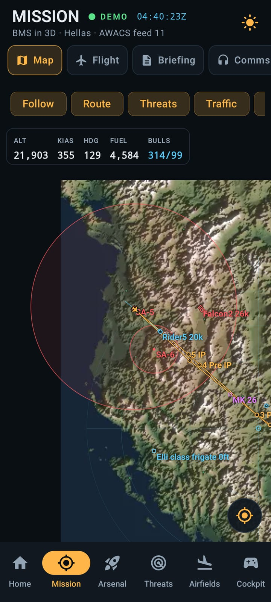

# Falcon BMS Companion

An Android companion for **Falcon BMS 4.38**, for phones and tablets. The goal is simple: **never alt-tab out of the sim.**

- **Offline reference:** aircraft and loadouts, the Threat Guide, HARM/RWR, airfields with charts, HOTAS, checklists, comms and a bullseye trainer. All of it is extracted from the game files.
- **Live Mission section:** a small Windows app, the **BMS Companion Bridge**, streams your current mission to the tablet. That covers the moving map with the AWACS picture, ownship data, RWR, DED, the briefing, loadout, comm plan and steerpoints. It also has one-tap **EZBoards** kneeboard generation.

> Unofficial fan project, not affiliated with Benchmark Sims. See [Credits & legal](#credits--legal).

| Live map & AWACS picture | Flight data & RWR | Briefing |
|---|---|---|
|  |  |  |
| **EZBoards from the tablet** | **Airfield charts** | **Phone** |
|  |  |  |

More in [docs/screenshots](docs/screenshots).

---

## Contents

- [Features](#features)
- [Download & install](#download--install)
- [Mission section setup](#mission-section-setup) (short version; full guide in [docs/SETUP.md](docs/SETUP.md))
- [Repository layout](#repository-layout)
- [Building](#building)
- [Updating for a new BMS version](#updating-for-a-new-bms-version)
- [Credits & legal](#credits--legal)

## Features

### Mission (live, via the PC bridge)
| Tab | What you get |
|---|---|
| **Map** | Theater map with your jet, the flight plan, target steerpoints, PPT threat rings, markpoints, bullseye rings, and the mission's home/alternate fields. It also shows the **AWACS picture**: friendly and hostile air, helicopters, ships and missiles, each with a speed vector, callsign and altitude. Tap anything to get BRAA, bullseye position and aspect, or to open the airfield and its charts. Follow mode and layer toggles are included. |
| **Flight** | An easy-to-read table: altitude, KIAS/Mach, heading, GS, fuel vs bingo, chaff/flares, bullseye position, VVI, G, TACAN, UHF and Zulu time. There is also an ALR-56M-style **RWR scope** (launch and lock warnings), a **DED** replica and the hostile **picture** list. |
| **Briefing** | Mission, package and TOT; departure, recovery and alternate airbases (TACAN, tower, ILS, runways, one tap to charts); the flight plan with TOS and bullseye; DTC targets; the package and roster; **loadout** per jet (tap a store to open the Arsenal page); threats linked to the Threat Guide; support (AWACS/tanker); weather; ROE; emergency procedures. |
| **Comms** | The comm ladder, grouped, with the tuned UHF frequency highlighted. DTC UHF/VHF presets, IFF and Link 16. |
| **Boards** | **Generate kneeboards** with EZBoards straight from the tablet. The console runs hidden on the PC and you get success or error feedback plus the log. The kneeboard content (package, comm ladder, steerpoints with min fuel, targets, weather) is shown natively. |
| **Setup** | Auto-discovery or manual IP, and a step-by-step BMS configuration guide and troubleshooting. |

### Offline reference (no PC needed)
- **Arsenal:** 323 flyable aircraft types (KTO + every add-on), per-theater variants, specs, station-by-station loadouts with rack capacity, and 518 stores.
- **Threat Guide:** SAM, AAA, radars, MANPADS, aircraft, AAMs and ships, with RWR symbols, HARM/ALIC codes, engagement envelopes and a range chart. HARM & RWR tables are included.
- **Airfields:** 519 unique airfields across the 5 theaters with their own map (KTO, Balkans, Hellas, Israel, Falklands). Runways, ILS, TACAN, frequencies, ATC patterns, nearest diverts, navaids and 1,386 charts. Also a searchable, zoomable theater map with towns.
- **Cockpit:** real HOTAS illustrations for the F-16C/D and F-15C (tap a switch to see what it does), checklists with check-off, comms/brevity, calculators.
- **Bullseye Trainer:** 5 game modes and 3 difficulty levels.
- **Global search** and favorites. The UI is dark and adapts to phone and tablet (a navigation rail and split panes on tablets).

## Download & install

Get the files from the GitHub **Releases** page:

| File | What |
|---|---|
| `BMS-Companion.apk` | Android app, including the airport charts (~64 MB) |
| `BMSCompanionBridge.exe` | Windows bridge for the Mission section. A single self-contained file; no install, no .NET needed. |

Install the APK on the phone or tablet (allow "install unknown apps"), or use `adb install -r BMS-Companion.apk`.

## Mission section setup

1. Run **BMSCompanionBridge.exe** on the BMS PC. On first launch its **Setup guide** walks you through every step below with live ✔/✖ checks (reopen it from the window or tray menu). Allow the bridge on private networks when Windows asks, or click *Allow through Windows Firewall* (TCP 47474 and UDP 47475, local subnet only).
2. On the tablet, open **Mission → Setup → Find bridge** (same Wi-Fi/LAN). If broadcasts are blocked, enter the IP shown in the bridge.
3. In the BMS Launcher, **Config → General → Briefing**: tick *Briefing Output to File* and untick *HTML Briefings*. In the mission Briefing screen press **PRINT**. **Save** the DTC.
4. For the AWACS picture, add these to `User\Config\Falcon BMS User.cfg`:
   ```
   set g_bTacviewRealTime 1
   set g_bTacviewAcmi 1
   ```
   Then turn on ACMI recording in 3D.
5. EZBoards ships with BMS in `Tools\EZBoards` and is found automatically (or pick the folder in the bridge). It needs the .NET 8 runtime.

No BMS at hand? Tick **Demo mode** in the bridge (or run `BMSCompanionBridge.exe --demo`) to try every Mission screen with a synthetic mission.

The full guide is in [docs/SETUP.md](docs/SETUP.md). The bridge API is described in [docs/PROTOCOL.md](docs/PROTOCOL.md).

### How the bridge gets its data
| Data | Source on the PC |
|---|---|
| Ownship, RWR, DED, steerpoints, PPTs, bullseye, theater, aircraft | BMS shared memory: `FalconSharedMemoryArea`, `…Area2`, `…AreaString` (layout from `Tools\SharedMem\FlightData.h`) |
| Other aircraft (AWACS picture) | BMS's built-in Tacview real-time telemetry server (`g_bTacviewRealTime`, port 42674) |
| Briefing, package, loadout, comm ladder, weather | `User\Briefings\briefing.txt` (the PRINT button; honours `g_sBriefingsDirectory`) |
| Steerpoint coordinates before 3D, targets, PPTs, radio presets | `User\Config\<callsign>.ini` (DTC Save) |
| Kneeboard tables | EZBoards `bin\xbrief.exe` (read-only, output to memory) |
| BMS folder, pilot callsign, theater | Registry `HKLM\SOFTWARE\WOW6432Node\Benchmark Sims\Falcon BMS 4.xx` (newest version found) |

The bridge only reads BMS files. The one thing it runs is EZBoards itself, when you ask it to; EZBoards then writes the kneeboard textures as it always does.

## Repository layout

```
app/                     Android app (Kotlin, Jetpack Compose, Material 3)
  src/main/assets/       extracted game data (JSON/WebP) and airport charts, generated by tools/extractor
  src/main/java/com/bmscompanion/app/
    data/                models + asset repository
    data/mission/        bridge client (HTTP polling, UDP discovery) and API models
    ui/screens/          reference screens
    ui/screens/mission/  Mission section (map, flight, briefing, comms, boards, setup)
pc/BmsCompanionBridge/   Windows bridge (C#, .NET 8 WinForms, no NuGet dependencies)
  Bms/                   shared memory structs & reader, briefing/DTC parsers, Tacview client, registry lookup
  EzBoards/              hidden EZBoards runner + xbrief table parser
  Server/                minimal HTTP server, UDP discovery, API DTOs
  Demo/                  synthetic mission for demo mode
pc/publish.ps1           builds the single-file BMSCompanionBridge.exe into dist/
tools/extractor/         Node.js extractor: BMS install -> app assets (read-only)
tools/curated/           data transcribed from the BMS manuals (threats, HOTAS, checklists, comms, HARM/RWR)
docs/                    SETUP, PROTOCOL, UPDATING, Reddit post, screenshots
CLAUDE.md                orientation notes for AI-assisted maintenance (Claude Code)
```

## Building

**Requirements:** JDK 17, Android SDK (API 35), .NET 8 SDK (bridge), Node 18+ (extractor only).

```bash
# Android app (debug on a connected device / release APKs)
./gradlew installDebug
./gradlew assembleRelease     # app/build/outputs/apk/release/app-release.apk

# PC bridge
dotnet build pc/BmsCompanionBridge -c Release
powershell -ExecutionPolicy Bypass -File pc/publish.ps1   # dist/BMSCompanionBridge.exe

# Regenerate reference data from a BMS install (read-only)
cd tools/extractor && npm install
BMS_ROOT="D:/Falcon BMS 4.38" node src/main.mjs   # aircraft, weapons, airports, maps, images
BMS_ROOT="D:/Falcon BMS 4.38" node src/charts.mjs # airport charts
```

Release APKs are signed with the debug key so anyone can build and side-load them. Use your own keystore if you publish to a store.

Command-line switches: `--demo` (synthetic mission for this run), `--guide` (open the setup guide). Developer checks: `--selftest out.txt` dumps struct sizes and parser output; `--eztest <EZBoards folder> out.txt` runs EZBoards like the app button does.

## Updating for a new BMS version

See **[docs/UPDATING.md](docs/UPDATING.md)**. It is a checklist written so it can be handed straight to Claude Code: re-run the extractor, diff `FlightData.h`, compare a fresh `briefing.txt`, check the add-on theaters, bump versions.

## Credits & legal

- Unofficial fan project, **not affiliated with Benchmark Sims**. Falcon BMS, its data, documentation, TacRef pictures, HOTAS illustrations and airport charts belong to Benchmark Sims and the respective add-on theater teams. This repository contains data extracted from the game install for personal reference use.
- **EZBoards** is by "Logic" and ships with BMS. This project only launches it.
- Tacview real-time telemetry is a protocol by Raia Software, implemented natively by BMS.
- App and bridge code: built with Claude Code.
