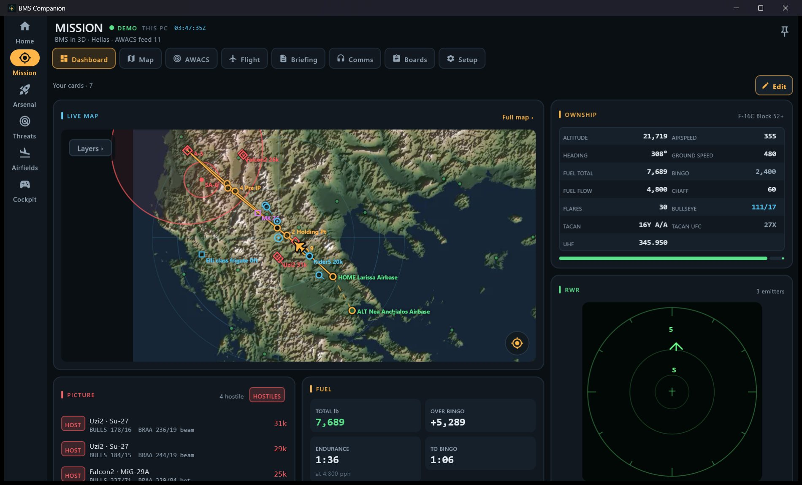
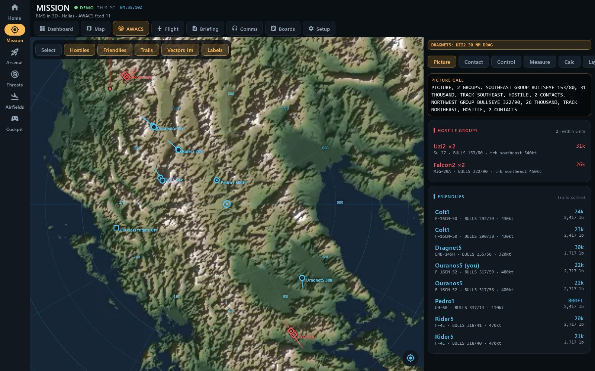
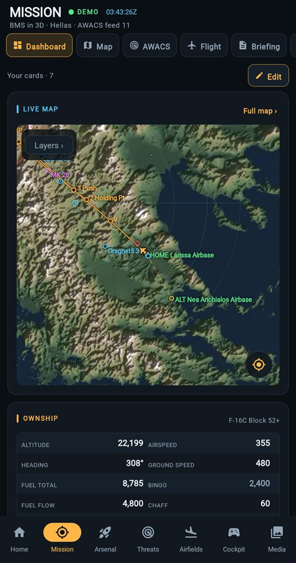
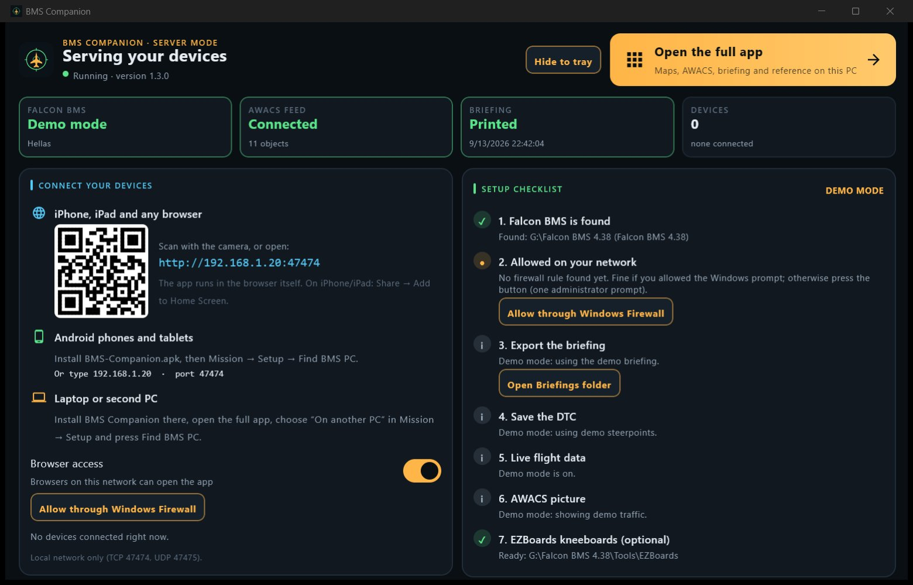
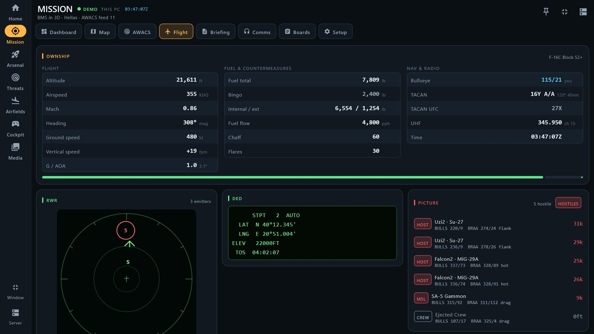
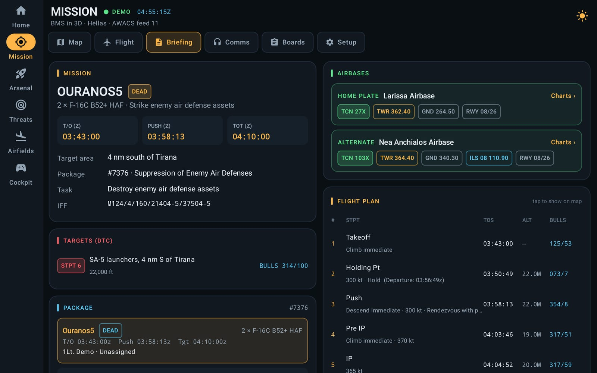
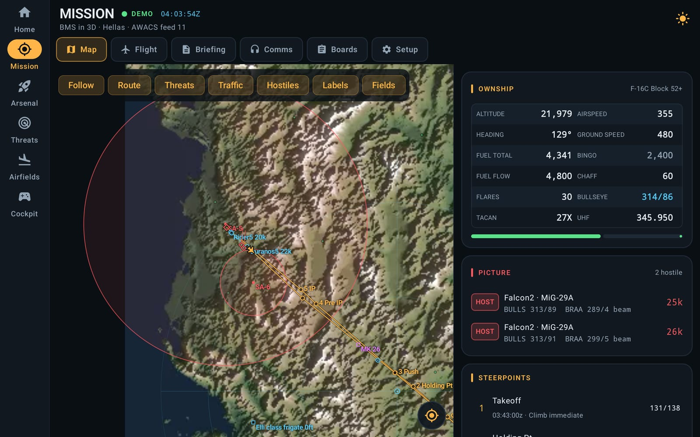
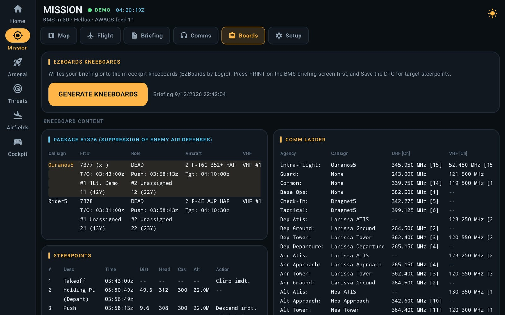
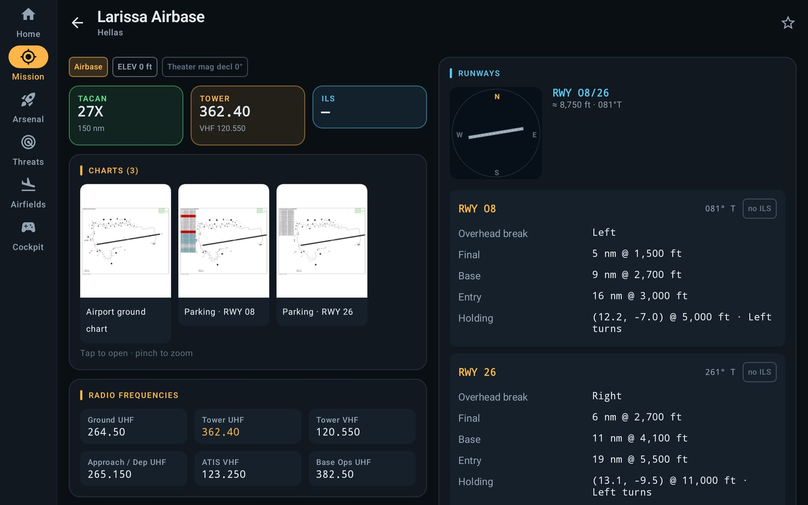

# Falcon BMS Companion

A companion for **Falcon BMS 4.38** that runs on **Windows PCs, Android phones and tablets, and iPhone, iPad or any browser**. One goal: **never alt-tab out of the sim.**

Everything it shows about the game — every airfield, chart, aircraft, weapon and threat — is **generated from your Falcon BMS install's own files**, not typed in by hand and not drawn by an artist. The install itself is only ever read.

> Unofficial fan project, not affiliated with Benchmark Sims. See [Credits & legal](#credits--legal).

| Dashboard (PC) | AWACS / GCI | Phone browser |
|---|---|---|
|  |  |  |
| **Server page on the BMS PC** | **Full screen on a second monitor** | **Briefing** |
|  |  |  |
| **Live map & AWACS picture (tablet)** | **EZBoards from the tablet** | **Airfield charts** |
|  |  |  |

More in [docs/screenshots](docs/screenshots) · what changed in each version: [CHANGELOG.md](CHANGELOG.md).

---

## Contents

**Getting it running**
- [Which files do I need?](#which-files-do-i-need)
- [Download & install](#download--install)
- [What you need](#what-you-need)
- [Quick setup](#quick-setup)

**What it does** — each feature says what it is, how to use it and what (if anything) to set up
- [Taxi — ground charts for every airfield](#taxi--ground-charts-for-every-airfield)
- [Mission: the live section](#mission-the-live-section)
- [Maps](#maps)
- [VR kneeboards](#vr-kneeboards)
- [Config — Falcon BMS's own settings](#config--falcon-bmss-own-settings)
- [Media — your BMS screenshots](#media--your-bms-screenshots)
- [Offline reference](#offline-reference)
- [BMS Companion for Windows](#bms-companion-for-windows)
- [Staying up to date](#staying-up-to-date)

**Under the hood**
- [How it works](#how-it-works)
- [Where the data comes from](#where-the-data-comes-from)
- [Repository layout](#repository-layout)
- [Building](#building)
- [Updating for a new BMS version](#updating-for-a-new-bms-version)
- [Credits & legal](#credits--legal)

---

## Which files do I need?

Every release has three files. Falcon BMS runs on a Windows PC, so **the BMS PC always gets BMS Companion for Windows**; it reads the sim and serves every other device. What else you download depends on where you want to see the companion.

| Your setup | For the BMS PC | For the other device | How to connect |
|---|---|---|---|
| **One PC only** (second monitor, or beside a windowed sim) | `BMS-Companion-PC.msi` | — | Press **Open the full app** on the server page. **F11** for borderless full screen. |
| **PC + Android phone or tablet** | `BMS-Companion-PC.msi` | `BMS-Companion.apk` | In the app: **Setup → Find BMS PC**. |
| **PC + iPhone or iPad** | `BMS-Companion-PC.msi` (keep **Browser access** on) | nothing | Scan the QR code on the server page, or open the address in Safari (iOS/iPadOS **18.2+**). **Share → Add to Home Screen** for an app icon. |
| **PC + any browser** (Mac, Linux, Chromebook, a TV) | `BMS-Companion-PC.msi` (keep **Browser access** on) | nothing | Open the address shown on the server page. |
| **2 PCs** (BMS PC + a laptop running the full app) | `BMS-Companion-PC.msi` | `BMS-Companion-PC.msi` | Laptop: **Open the full app** → **Setup** → **On another PC** → **Find BMS PC**. |
| **VR** (OpenKneeboard in the headset) | `BMS-Companion-PC.msi` | nothing | Add a **Web Dashboard** tab per board, pointing at `http://<pc>:47474/kneeboard/1`, `/2`, … See [VR kneeboards](#vr-kneeboards). |
| **Reference only, no PC** | — | `BMS-Companion.apk` | Nothing to connect: the reference and every ground chart work offline. |

- **`.msi` or `.zip`?** The same program. The **MSI** installs it (Start menu, desktop shortcut, updates in place); the **zip** is portable — unzip anywhere and run `BMS Companion.exe`. Pick one.
- **The browser version needs the PC.** iPhone, iPad and browsers load the app from BMS Companion over your home network. There is no App Store app.
- **Coming from 1.2?** `BMSCompanionBridge.exe` is gone. Exit it (tray icon → Exit), delete it, install `BMS-Companion-PC.msi`; it uses the same port and keeps your settings.

## Download & install

From the **[latest release](https://github.com/Scorpion-41/Falcon-BMS-Companion/releases/latest)**:

| File | What it is |
|---|---|
| `BMS-Companion-PC.msi` | **BMS Companion for Windows** — reads Falcon BMS, serves your devices and browsers, and is the full app. Per-machine install with Start menu and desktop shortcuts; brings its own Java runtime and the browser version (~325 MB). |
| `BMS-Companion-PC.zip` | The same, portable (~323 MB). |
| `BMS-Companion.apk` | The Android app, including every ground chart, instrument chart and map style (~215 MB). |

Install the APK on the phone or tablet (allow "install unknown apps"), or `adb install -r BMS-Companion.apk`. iPhone and iPad need nothing installed.

The installer is not code-signed, so Windows SmartScreen may ask you to confirm (**More info → Run anyway**).

## What you need

**BMS Companion itself needs nothing installed.** The Windows package brings its own Java runtime, and the browser version runs in a browser you already have. The list below is only for the parts that lean on something else — the app checks on first run and links each one's official page.

| | What for | Where |
|---|---|---|
| **Falcon BMS 4.38** | everything: the app reads your install | [falcon-bms.com](https://www.falcon-bms.com) |
| Windows 10 or 11 (64-bit) | the PC program | — |
| A browser with WebAssembly GC — Edge/Chrome 119+, Firefox 120+, Safari 18.2+ | the browser version | already on the device |
| Android 8 or newer | the Android app | — |
| **.NET 8 runtime** *(optional)* | generating kneeboards with EZBoards, which BMS ships | [dotnet.microsoft.com](https://dotnet.microsoft.com/en-us/download/dotnet/8.0) |
| **OpenKneeboard** *(optional)* | the VR kneeboards | [openkneeboard.com](https://openkneeboard.com) |
| **Microsoft Edge WebView2 runtime** *(optional)* | OpenKneeboard's web tabs. Windows 11 has it; some Windows 10 machines do not | [developer.microsoft.com](https://developer.microsoft.com/microsoft-edge/webview2/) |
| **HTML Briefing** (`Tools\html_brief_win`, optional) | showing the kneeboard that tool exports | ships with BMS |

Nothing is installed or downloaded on your behalf: the first-run card names what is missing and opens the maker's own page.

## Quick setup

1. **BMS PC** — install `BMS-Companion-PC.msi` and start it. It opens on the **server page**. When Windows asks, allow private networks (or press **Allow through Windows Firewall**). Flying with the app on this PC? Press **Open the full app**.
2. **Falcon BMS** — in the Launcher, **Config → General → Briefing**: tick *Briefing Output to File*, untick *HTML Briefings*. In the mission Briefing screen press **PRINT**, and **Save** the DTC.
3. **AWACS picture** — add these to `User\Config\Falcon BMS User.cfg` (the setup checklist has an edit button, or use the [Config](#config--falcon-bmss-own-settings) section), then turn on ACMI recording in 3D with **F**:
   ```
   set g_bTacviewRealTime 1
   set g_bTacviewAcmi 1
   ```
4. **Your devices**
   - **Android:** **Setup → Find BMS PC** (same Wi-Fi/LAN).
   - **iPhone/iPad/browser:** scan the QR code on the server page, or open the address it shows (e.g. `http://192.168.1.20:47474`). **Share → Add to Home Screen** for a full-screen icon.
   - **Laptop/second PC:** install BMS Companion, **Open the full app**, choose **On another PC** in **Setup**, then **Find BMS PC**.
5. **EZBoards** ships with BMS in `Tools\EZBoards` and is found automatically. It needs the .NET 8 runtime.

The full guide is [docs/SETUP.md](docs/SETUP.md). The network API is [docs/PROTOCOL.md](docs/PROTOCOL.md).

---

## Taxi — ground charts for every airfield

**1,840 charted airfields across all 19 theaters, in the app itself.** Runways, every taxiway with its letter, hold short points, the real pavement, the buildings, and every parking spot with the number BMS gives it. 133 of them are carrier decks.

**These are not pictures.** Every chart is generated from Falcon BMS's own game files: the airfield data the sim uses to taxi its own AI, and — for the asphalt — the airfield's 3D model, read directly out of the game. The taxiways run where the sim drives, the aprons and dispersals are the real shapes with straight edges and square corners, and the parking numbers are the ones the tower gives you. They were checked field by field against the parking charts the theaters ship, which print a latitude and longitude for every spot.

**How to use it**

1. Open **Mission → Taxi** (or **Airfields → a field → Ground chart → Open** for any field, any time).
2. With Falcon BMS running the page already knows where you are: your field, and the spot you spawned on.
3. Press the **RWY** button for the runway in use. In a mission it is usually chosen for you — the sim parks you on the half of the ramp nearest the active runway, so the spot you are on says which one it is.
4. Pick your parking spot: tap it on the chart, or tap its number in the list.
5. Read the clearance — *"Taxi to runway 26 via B, A, H. Hold short runway 26."* — with the way drawn in blue, the turn at each junction and the distance of every leg.
6. Landed instead? Press **Taxi in** and pick the spot you were given; it draws the way in from the runway.

Press the same **RWY** button again to clear it and put the chart back to plain. Nothing is drawn until you ask for it.

**Also on the chart:** a **Day/Night** switch (remembered), zoom by wheel, pinch or buttons, hardened shelters and hangars drawn as bays you taxi into nose-first, taxiway letters on yellow boards where BMS puts its own signs, and spot numbers that step aside and draw a leader line rather than piling up.

**Carriers.** Falcon BMS publishes nothing usable for a ship — its deck points run a mile past the bow because the approach path is in the same list, and its "runways" are that approach path, a catapult and sometimes a rectangle of no width. So a carrier is drawn from the **published dimensions of the real ship**: the flight deck with its angled-deck sponson, the landing area at its real angle, the catapults, the ski jump where the class has one, and the island. A carrier page is the deck and the day/night switch — no ramp, no runway buttons, no taxi route, because a ship steams into wind and the numbers turn with it.

**Setting it up:** nothing. The charts are in the app. Live position and the runway in use come from Falcon BMS through the PC, so they need the normal [Quick setup](#quick-setup); everything else works with BMS closed.

## Mission: the live section

| Tab | What you get |
|---|---|
| **Dashboard** | Your own page, built from cards: live map, ownship, RWR, DED, picture, fuel (endurance, time to bingo, fuel to get home), time & TOT countdowns, bullseye, threat rings, steerpoints, mission, airbases, comm ladder, radio presets, tankers & support, kneeboards. **Edit** to add, move, resize (S/M/L) and remove cards, or take a preset (Pilot, Cockpit, Navigator, Pre-flight, In flight). Phones and wide screens keep their own layouts. |
| **Map** | The theater with your jet, the flight plan, target steerpoints, PPT threat rings, markpoints, bullseye rings and the mission's fields — plus the **AWACS picture**: friendly and hostile air, helicopters, ships and missiles with speed vectors, callsigns and altitudes; tankers (green, with a boom) and AWACS/JSTARS (purple, with a rotodome) stand out; SAM sites carry their real ring. Tap anything for BRAA, bullseye position and aspect, or to open that airfield. Follow mode, layer toggles and the **Map** menu. |
| **Taxi** | The ground chart — see [above](#taxi--ground-charts-for-every-airfield). |
| **AWACS** *(optional, off by default)* | A GCI console for a human controller in multiplayer: the whole picture with trails and speed vectors, hostile group circles, radar-lock lines, labelled bullseye rings, ready-to-read picture calls, per-contact BRAA and bullseye, flight control (threats, closure, time to merge, vector calls, nearest field and fuel to reach it), an A→B measure tool, calculators, filters and alerts. Turn it on in **Setup → Mission pages**. |
| **Briefing** | Mission, package and TOT; departure, recovery and alternate (TACAN, tower, ILS, runways, one tap to the charts); the flight plan with TOS and bullseye; DTC targets; package and roster; **loadout** per jet (tap a store for its Arsenal page); threats linked to the Threat Guide; tankers & support; weather; ROE; emergency procedures. Plus the pages UOAF's **HTML Briefing** tool exported, if you use it. |
| **Comms** | The comm ladder, grouped, with the tuned UHF highlighted. Tankers & support. DTC UHF/VHF presets, IFF and Link 16. |
| **Kneeboards** | Everything that gets printed or pinned: **generate BMS's kneeboards** with EZBoards from any device (the console runs hidden on the PC; you get success or failure and the log), the kneeboard content shown natively, the **VR boards** setup, and the HTML Briefing pages. |

**Tankers & support** (a Dashboard card, and on Briefing and Comms): every tanker, AWACS, JSTARS and FAC in one table — role, callsign, aircraft, **TACAN** (with the channel to set to tie on), **UHF** with its preset, **location** from bullseye and altitude when airborne, every comm channel the briefing gives for it, and the briefing notes. Yours is marked. Planned tanker and AWACS **tracks** are drawn on the map, read out of the campaign file the mission is flying.

**Setting it up:** the [Quick setup](#quick-setup) above. Briefing data needs **PRINT**; steerpoints before you are in 3D need the **DTC Save**; the AWACS picture needs the two Tacview lines and ACMI recording (**F**).

## Maps

Every map (Mission, Dashboard, AWACS, Airfields) has **+ / −** buttons besides pinch, double-tap and the mouse wheel, and a **Map** menu:

- **Four styles** — **Relief** (shaded terrain from the BMS heightmap), **Satellite** (the sim's own ground texture), **Dark** (muted, for a busy picture) and **Chart** (light, paper-like). All four line up exactly: switching never moves anything.
- **Zoom levels** — an overview, then sharper tiles as you go in, up to 8192 px across a theater (~125 m per pixel on the 1024 km theaters). All of it ships in the apps.
- **Landmarks** — country borders with names, provinces as faint dashed lines, and towns as dashed circles (cities, then towns, then villages as you zoom; labels never overlap).
- **Towns → Mission** (the default) — only the towns that matter: those the briefing names, the nearest town to each steerpoint, target, threat and airbase, and the larger towns on your route. The **target town** gets a solid amber ring and a bold name.

Borders and names come from Natural Earth, projected with each theater's own projection out of `NewTerrain/Theater.txt` and checked against real airport positions (median error under 0.4 nm).

**Setting it up:** nothing — the maps are in the app.

## VR kneeboards

The browser version doubles as an **OpenKneeboard web dashboard**, laid out for a board a few hundred pixels across: the content fills it, and a ☰ and ⋯ float in a corner and fade when the mouse stops. Each board is its own address, so you can have several tabs showing different things.

**Board kinds:** live map · **Live taxi** · **Ground chart** · briefing · comms · HARM table · instrument charts · the exported HTML Briefing · the Dashboard.

- **Live taxi** draws the field you are **actually standing on**, briefed or not, with your jet on it and what is ahead of you up the page. **Its pages are zoom steps** — the *next page* / *previous page* buttons you already have bound zoom the chart from the whole field down to a couple of stands either side. There is no mouse in VR, so a bound button is the only control there is.
- **Ground chart** is one page per runway end, to read before start-up or on the way in, with your own position marked.

Because OpenKneeboard stops at the last page it was given, every board lays down a run of pages and cycles through them, so a bound button always has somewhere to go. Print size and board shape are on the ☰ menu.

**Setting it up**

1. Install [OpenKneeboard](https://openkneeboard.com) (and the WebView2 runtime if Windows asks).
2. In BMS Companion on the PC: **Mission → Kneeboards → VR boards**. Choose what each board shows and press **Configure** on a row for its options (day or night chart, which way up, how much of the field fits).
3. In OpenKneeboard, add a **Web Dashboard** tab per board and give it `http://<your-pc>:47474/kneeboard/1` — then `/2`, `/3`, … for the rest. The page names its own tab.
4. Bind next/previous page in OpenKneeboard if you have not already. That is how you flip boards and zoom the Live taxi chart.

## Config — Falcon BMS's own settings

Falcon BMS keeps several hundred settings in a text file its own screens never show you. This section lists all of them, says what each one does, and writes only the ones you change.

**It is off until you ask for it:** **Setup → Mission pages → Show the Config section**. It then appears as a section of its own, on the PC, in the browser and on a tablet alike — so you can change a setting from the sofa for the flight about to start.

**How to use it**

1. Turn it on in Setup, then open **Config**.
2. Press **Click to Back Up and Enable**. Your `Falcon BMS User.cfg` is copied into a `BackUp` folder beside it. That copy is taken **once and never replaced**, so there is always a way back to exactly what you had.
3. Three profiles are laid down at the same time. **Profile 1** is a copy of what you already had; **2** and **3** start empty, which in a config file means every setting at its Falcon BMS default.
4. Pick a file (**User**, or **VR** if you fly in a headset) and a profile, and change what you like: switches for switches, a list for the settings that take named choices, a box for the rest.
5. **Search** by name or by what a setting does. The box never scrolls away, and the group you are looking at stays under it.
6. **⋯** makes a profile the one BMS reads, copies one profile into another, or puts a profile back to your original file.

**What it shows.** The settings your file actually holds are listed **first and marked**; everything else is shown dim at its default. Change one and it moves up into the first list — which is exactly what it does in the file, because a setting left at its default is not written at all. The 219 settings are grouped (VR, graphics, terrain, cockpit and avionics, views, sound, multiplayer, campaign) and described in BMS's own words, read out of the stock config your version ships with.

**What it never touches.** The lines your BMS launcher writes at the end of the file: they are shown, carried across untouched when you switch profiles, and anything new is written above them. Nothing outside `User/Config` is written, and no file is written over in place — the new one is written beside it and moved across, so a failed write can never leave you with half a config.

> These are Falcon BMS's own settings and a wrong one can stop BMS starting. That is what the backup is for. The page says so in red, and it is meant.

## Media — your BMS screenshots

The screenshots you take in Falcon BMS (`User\Pictures`, or `g_sPicturesDirectory`), on any device: a gallery grouped by day, a full-screen viewer with zoom and previous/next, multi-select, and **delete** — to the Recycle Bin on the BMS PC, so it can be undone.

- **Android:** Share to any app, or **Download to this device** (Pictures/BMS Companion).
- **Browsers (iPhone, iPad…):** Download, or the system share sheet, one or several at once.
- **PC client (laptop):** Download to this PC, copy to clipboard, save a copy.
- **On the BMS PC:** copy to clipboard, save a copy, open the folder.

**Setting it up:** nothing, once the device is connected. If BMS writes its screenshots somewhere unusual, point **Screenshots folder** at it in the PC's Falcon BMS settings.

## Offline reference

Works with no PC and no connection — it is all in the app.

- **Arsenal** — 323 flyable aircraft types (KTO and every add-on), per-theater variants, specs, station-by-station loadouts with rack capacity, and 518 stores.
- **Threat Guide** — SAMs, AAA, radars, MANPADS, aircraft, AAMs and ships, with RWR symbols, HARM/ALIC codes, engagement envelopes and a range chart. HARM and RWR tables included.
- **Airfields** — every field across the theaters: runways, ILS, TACAN, frequencies, ATC patterns, nearest diverts, navaids, the **ground chart** (above), and the **instrument charts** of the theaters that ship them as PDFs — 244 charts, 988 pages, with a page bar.
- **Cockpit** — real HOTAS illustrations for the F-16C/D and F-15C (tap a switch to see what it does), checklists with check-off, comms and brevity, calculators.
- **Bullseye Trainer** — 5 game modes, 3 difficulty levels.
- **Global search** and favorites, on a dark UI that adapts from a phone to a tablet to a PC.

## BMS Companion for Windows

**One program, one window, two faces**, remembered between runs.

- **Server page** (first start) — one light page for a PC that serves your devices: live status (Falcon BMS, AWACS feed, briefing, connected devices), **Connect your devices** with the address and a QR code, the **setup checklist** with live ✓/✕ checks and a fix button for each step, Falcon BMS settings, recent activity and start-up options. The full app is not loaded, so it uses little memory.
- **Full app** — every section, with data from Falcon BMS on this PC or from the BMS PC over the network (**On another PC**, for a laptop). **Open the full app** on the server page and the **Server** button at the foot of the navigation rail switch between them in one click.
- **Borderless full screen** — **F11**, or the button at the top of the rail, fills the monitor the window is on. Esc or F11 to leave. The pin keeps the window on top.
- **Only one copy runs** — opening it again brings the running window forward, also from the tray.
- **Tray icon** — open, switch faces, browser access on/off, exit. Closing the window can keep it serving in the tray, and it can start with Windows.
- **Falcon BMS settings in the app** — BMS, EZBoards and screenshot folders, kneeboards on PRINT, the Tacview stream (host, port, password), network port, firewall rules in one prompt, and a button to edit `Falcon BMS User.cfg`.
- **PC extras** — mouse-wheel zoom on maps and charts, UI zoom with **Ctrl +/−/0**, dark title bar, remembered window size and position.

## Staying up to date

The app checks GitHub once, quietly, when it starts — nothing interrupts you. If there is something newer, a small badge appears in the corner and a dot on the About card. **About → Download** shows the release notes of every version between yours and the newest, downloads it with the rate and time left, checks it against the checksum the release publishes, and installs it: the MSI on Windows, the APK on Android. An interrupted download is resumed, not fetched again.

---

## How it works

```
Falcon BMS (shared memory, briefing.txt, DTC .ini, Tacview RT stream, EZBoards, screenshots)
   │ read-only
   ▼
BMS Companion for Windows ──┬─ its own window: server page or full app (reads BMS directly)
   HTTP 47474, UDP 47475    ├─ Android app, client PCs: mission API (/api/…), discovery on UDP 47475
                            ├─ browsers: the web app (/) runs on the device, data from /api and /assets
                            └─ VR: /kneeboard/<n>, one OpenKneeboard Web Dashboard tab each
```

The Android app, the PC program and the browser version are built from the same Kotlin/Compose code, so every device shows the same screens. The browser version is that code compiled to WebAssembly: it runs on the phone or tablet like a native app, and the PC only sends it data.

**BMS Companion only reads your BMS install**, with three things you trigger yourself: it runs EZBoards (which then writes the kneeboard textures as it always does), it moves screenshots you delete in Media to the Recycle Bin, and — only after you press the backup button — the [Config](#config--falcon-bmss-own-settings) section edits `User/Config`.

## Where the data comes from

| Data | Source on the PC |
|---|---|
| Ownship, RWR, DED, steerpoints, PPTs, bullseye, theater, aircraft, TACAN | BMS shared memory: `FalconSharedMemoryArea`, `…Area2`, `…AreaString` (layout from `Tools\SharedMem\FlightData.h`) |
| Other aircraft (the AWACS picture) with speed, fuel and radar locks | BMS's own Tacview real-time telemetry server (`g_bTacviewRealTime`, port 42674) |
| Who is friendly, hostile or neutral | the campaign save's team table — Tacview reports the *country*, not the side |
| Briefing, package, loadout, comm ladder, weather | `User\Briefings\briefing.txt` (the PRINT button; honours `g_sBriefingsDirectory`) |
| Steerpoints before 3D, targets, PPTs, radio presets | `User\Config\<callsign>.ini` (DTC Save) |
| Planned tanker and AWACS tracks | the campaign file the mission is flying (`.cam`/`.tac`) |
| Ground charts: runways, taxiways, ramp spots, buildings | each field's own authored data, `ObjectiveRelatedData/OCD_nnnnn/` |
| Ground charts: the asphalt | the field's own 3D model, decoded from the game |
| Kneeboard tables | EZBoards `bin\xbrief.exe` (read-only, output to memory) |
| Screenshots | `User\Pictures` (or `g_sPicturesDirectory`); thumbnails made on the PC |
| The Config list | the stock `User\Config\Falcon BMS.cfg` your version ships with |
| BMS folder, pilot callsign, theater | Registry `HKLM\SOFTWARE\WOW6432Node\Benchmark Sims\Falcon BMS 4.xx` |

Everything bundled in the apps — aircraft, weapons, threats, airfields, charts, maps, ground charts — is produced by the extractor in `tools/extractor` from a real install, and checked against something the game itself publishes. [docs/DATA-SOURCES.md](docs/DATA-SOURCES.md) has a row per feature: the file it comes from, how the reading is verified, and what to look at when that file changes.

## Repository layout

```
app/                     Android app (Kotlin, Jetpack Compose, Material 3)
  src/main/assets/       extracted game data (JSON/WebP): ground charts, instrument charts,
                         maps/<theater>/<style> tiles, data/geo landmarks, data/cfg options
  src/main/java/com/bmscompanion/app/
    data/                models + asset repository
    data/airfield/       ground chart models and taxi routing
    data/mission/        mission client (HTTP polling, UDP discovery) and API models
    ui/board/            VR kneeboard pages
    ui/screens/          reference screens, Airfields, Taxi, Config, Setup, Media
    ui/screens/mission/  Mission section: tabs, Dashboard, Map, Taxi, AWACS, Briefing, Comms, Kneeboards
desktop/                 BMS Companion for Windows (Kotlin, Compose for Desktop). Compiles app/src/main/java as-is, plus:
  src/main/kotlin/overrides/   PC versions of the Android-only files
  src/main/kotlin/shims/       stand-ins for the Android APIs the shared screens call
  src/main/kotlin/com/bmscompanion/desktop/
    Main.kt                    the window (server page or full app, full screen), tray, single instance
    PcConfig.kt, PcServer.kt   mode and services; the HTTP server (API, web app, bundled data, boards)
    bridge/                    reads Falcon BMS: shared memory, briefing/DTC parsers, Tacview client,
                               EZBoards, screenshots, campaign saves, and the Config file service
    ui/                        server page and settings cards
web/                     browser version (Kotlin/Wasm, Compose for Web), same shared code
pc/publish-desktop.ps1   builds dist/BMS-Companion-PC.msi and .zip, with the browser version inside
tools/extractor/         Node.js extractor: BMS install -> app assets (read-only)
tools/curated/           data transcribed from the BMS manuals, plus the carrier deck dimensions
docs/                    SETUP, PROTOCOL, DATA-SOURCES, UPDATING, screenshots
CHANGELOG.md             what changed in each version
CLAUDE.md                orientation notes for AI-assisted maintenance
```

## Building

**Requirements:** JDK 17 (with jpackage, for the PC installer), Android SDK (API 35), Node 18+ (extractor only). The browser build downloads its own Node.js, Yarn and Binaryen into the Gradle cache.

```bash
# Android app
./gradlew installDebug
./gradlew assembleRelease                                        # app/build/outputs/apk/release/

# BMS Companion for Windows (the browser version is built and packed in automatically)
./gradlew :desktop:run
powershell -ExecutionPolicy Bypass -File pc/publish-desktop.ps1  # dist/BMS-Companion-PC.msi + .zip

# Browser version on its own
./gradlew :web:wasmJsBrowserDistribution

# Regenerate the bundled data from a BMS install (read-only)
cd tools/extractor && npm install
BMS_ROOT="D:/Falcon BMS 4.38" node src/main.mjs        # aircraft, weapons, airports, ground charts, theaters
BMS_ROOT="D:/Falcon BMS 4.38" node src/airfieldrun.mjs # ground charts only
BMS_ROOT="D:/Falcon BMS 4.38" node src/charts.mjs      # instrument charts
BMS_ROOT="D:/Falcon BMS 4.38" node src/maps.mjs        # map styles and tile levels (~30 min)
BMS_ROOT="D:/Falcon BMS 4.38" node src/geo.mjs         # borders, provinces and labels
```

Release APKs are signed with the debug key so anyone can build and side-load them.

**PC program switches:** `--tray` (start in the tray), `--route <route>` or `BMSC_ROUTE=mission` (open a screen directly), `BMSC_PORT=<port>` (another port for this run). Developer checks: `--selftest`, `--dumpstrings`, `--eztest`, `--cfgtest`, `--api`, `--maprender`, `--updatetest`, and the campaign-save checks (`--atotest`, `--trackstest`, `--teamtest`, `--sidetest`). The browser version accepts `?route=mission`.

## Updating for a new BMS version

See **[docs/UPDATING.md](docs/UPDATING.md)** — a checklist written so it can be handed straight to Claude Code: re-run the extractor, diff `FlightData.h`, compare a fresh `briefing.txt`, check the add-on theaters, bump the version. [docs/DATA-SOURCES.md](docs/DATA-SOURCES.md) says, per feature, what to look at when a BMS file changes.

## Credits & legal

- Unofficial fan project, **not affiliated with Benchmark Sims**. Falcon BMS, its data, documentation, TacRef pictures, HOTAS illustrations and airport charts belong to Benchmark Sims and the respective add-on theater teams. This repository contains data extracted from the game install for personal reference use.
- **[OpenKneeboard](https://openkneeboard.com/)** is by Fred Emmott. The VR boards are Web Dashboard tabs in it.
- **EZBoards** is by "Logic" and ships with BMS. This project only launches it (and the extractor uses its bundled Microsoft `texconv` to decode the BMS ground texture).
- Borders, provinces and country/region names: **[Natural Earth](https://www.naturalearthdata.com)** 1:10m data, public domain.
- Carrier flight-deck dimensions are the published figures for each real class.
- Tacview real-time telemetry is a protocol by Raia Software, implemented natively by BMS.
- App, PC program and browser version: written by **LoneWolf-41** with Claude Code.
