# Falcon BMS Companion

A companion for **Falcon BMS 4.38** on **Windows PCs, Android phones and tablets, and iPhone, iPad or any browser**: the live mission, a mission planner, ground charts for every airfield, a weather generator, VR kneeboards and an offline reference, so the sim never has to be left for a second window.

Everything it shows about the game — airfields, charts, aircraft, weapons, threats — is **generated from the Falcon BMS install's own files**. The install is read only, except where a feature writes on request; see [What it writes to the BMS folder](#what-it-writes-to-the-bms-folder).

**New in 1.3.9:** lines, PPTs and Open 1/2 steerpoints that survive BMS's DTC LOAD and SAVE, with a clean start for each opened mission; **Add to Open bank…** on the Planner's Map page; control towers, arresting cables and free rotation on the ground charts; checked photographs in the Reference section. Full list: [CHANGELOG.md](CHANGELOG.md).

**New in 1.3.8:** **WDP for Falcon BMS 4.38.1**, a port of Falcas's Weapon Delivery Planner on every device, and a choice of source for the Mission section: BMS's printed briefing (**EZBoards mode**) or the planned flight (**WDP mode**). Also live **MFDs**, **Dashboard pages**, a **weather generator**, carrier decks drawn from BMS's models, a **Radio** page with automatic taxi, and a **Reference** section with coordinates and radios for every airfield. Full list: [CHANGELOG.md](CHANGELOG.md).

> Unofficial fan project, not affiliated with Benchmark Sims. See [Credits & licences](#credits--licences).

| Mission Dashboard | Mission map | Planner (WDP) DataCard |
|---|---|---|
| 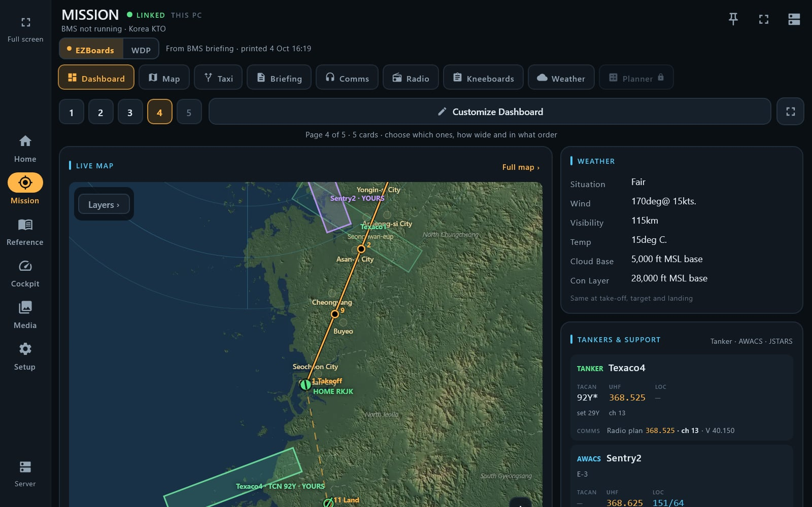 | 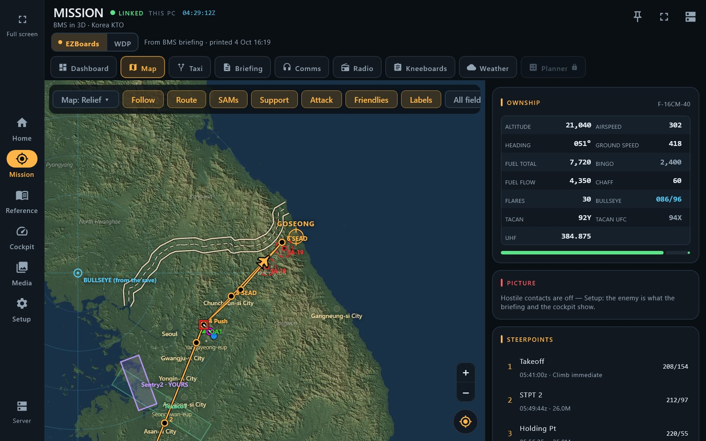 | 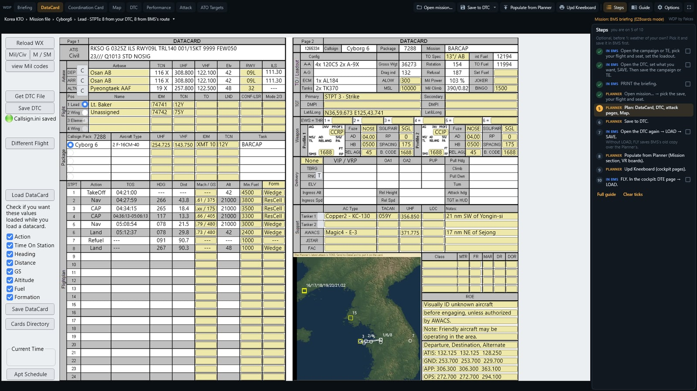 |
| **Taxi page** | **Weather generator** | **Phone** |
| 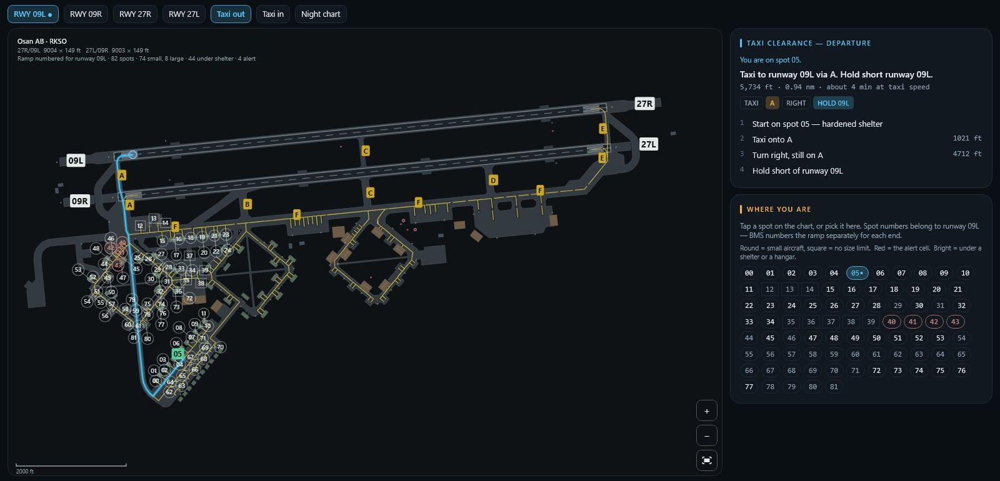 | 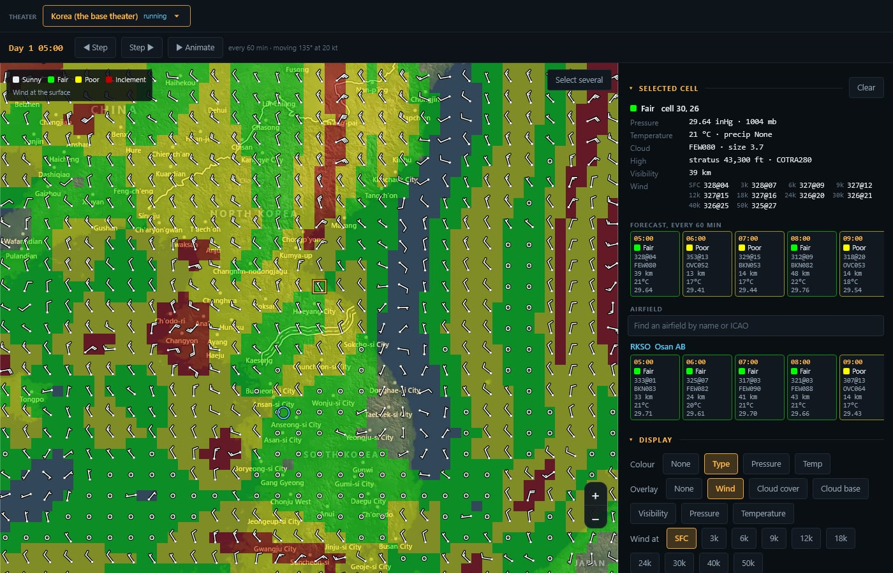 | 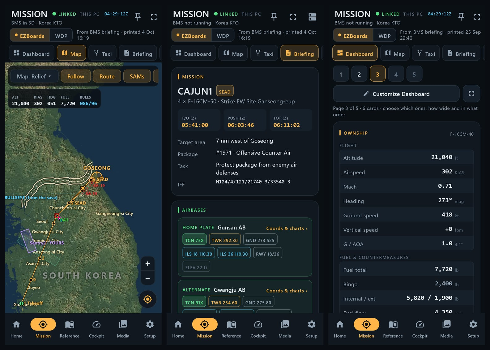 |

All pictures: [docs/screenshots](docs/screenshots). They are drawn by the app from test copies of a BMS install.

---

## Contents

**Getting started**
- [Which files do I need?](#which-files-do-i-need)
- [Download & install](#download--install)
- [What you need](#what-you-need)
- [Quick setup](#quick-setup)

**Features**
- [Mission section](#mission-section) — Dashboard and MFDs, Map, Taxi, Briefing and Comms, Radio, Kneeboards, Weather
- [Two modes: EZBoards or WDP](#two-modes-ezboards-or-wdp)
- [Planner: WDP for Falcon BMS 4.38.1](#planner-wdp-for-falcon-bms-4381)
- [Maps](#maps)
- [Which kneeboard is which](#which-kneeboard-is-which)
- [VR kneeboards](#vr-kneeboards)
- [Weather generator](#weather-generator)
- [Reference: Airfields, Map, Threats, Arsenal](#reference-airfields-map-threats-arsenal)
- [Cockpit and training](#cockpit-and-training)
- [Config: Falcon BMS's own settings](#config-falcon-bmss-own-settings)
- [Media: BMS screenshots](#media-bms-screenshots)
- [BMS Companion for Windows](#bms-companion-for-windows)
- [Android and the browser](#android-and-the-browser)
- [Staying up to date](#staying-up-to-date)

**Under the hood**
- [What it writes to the BMS folder](#what-it-writes-to-the-bms-folder)
- [How it works](#how-it-works)
- [Where the data comes from](#where-the-data-comes-from)
- [Repository layout](#repository-layout)
- [Building](#building)
- [Updating for a new BMS version](#updating-for-a-new-bms-version)
- [Credits & licences](#credits--licences)

---

## Which files do I need?

Every release has three files. Falcon BMS runs on a Windows PC, so **the BMS PC always gets BMS Companion for Windows**; it reads the sim and serves every other device. What else you download depends on where you want to see the companion.

| Your setup | For the BMS PC | For the other device | How to connect |
|---|---|---|---|
| **One PC only** (second monitor, or beside a windowed sim) | `BMS-Companion-PC.msi` | — | Press **Open the full app** on the server page. **F11** for borderless full screen. |
| **PC + Android phone or tablet** | `BMS-Companion-PC.msi` | `BMS-Companion.apk` | In the app: **Setup → Find BMS PC**. |
| **PC + iPhone or iPad** | `BMS-Companion-PC.msi` (keep **Browser access** on) | nothing | Scan the QR code on the server page, or open the address in Safari (iOS/iPadOS **18.2+**). **Share → Add to Home Screen** for an app icon. |
| **PC + any browser** (Mac, Linux, Chromebook, a TV) | `BMS-Companion-PC.msi` (keep **Browser access** on) | nothing | Open the address shown on the server page. |
| **2 PCs** (BMS PC + a laptop running the full app) | `BMS-Companion-PC.msi` | `BMS-Companion-PC.msi` | Laptop: **Open the full app** → **Setup** → **On another PC** → **Find BMS PC**. |
| **VR** (OpenKneeboard in the headset) | `BMS-Companion-PC.msi` | nothing | Add a **Web Dashboard** tab per board, pointing at `http://<pc>:47474/kneeboard/1`, `/2`, … See [VR kneeboards](#vr-kneeboards). |
| **Reference only, no PC** | — | `BMS-Companion.apk` | Nothing to connect: the reference and every ground chart work offline. |

- **`.msi` or `.zip`?** The same program. The **MSI** installs it (Start menu, desktop shortcut, updates in place); the **zip** is portable — unzip anywhere and run `BMS Companion.exe`. Pick one.
- **The browser version needs the PC.** iPhone, iPad and browsers load the app from BMS Companion over your home network. There is no App Store app.
- **Coming from 1.2?** `BMSCompanionBridge.exe` is gone. Exit it (tray icon → Exit), delete it, install `BMS-Companion-PC.msi`; it uses the same port and keeps your settings.

## Download & install

From the **[latest release](https://github.com/Scorpion-41/Falcon-BMS-Companion/releases/latest)**:

| File | What it is |
|---|---|
| `BMS-Companion-PC.msi` | **BMS Companion for Windows** — reads Falcon BMS, serves your devices and browsers, and is the full app. Per-machine install with Start menu and desktop shortcuts; brings its own Java runtime and the browser version (~325 MB). |
| `BMS-Companion-PC.zip` | The same, portable (~323 MB). |
| `BMS-Companion.apk` | The Android app, including every ground chart, instrument chart and map style (~215 MB). |

Install the APK on the phone or tablet (allow "install unknown apps"), or `adb install -r BMS-Companion.apk`. iPhone and iPad need nothing installed.

The installer is not code-signed, so Windows SmartScreen may ask you to confirm (**More info → Run anyway**).

## What you need

**BMS Companion itself needs nothing installed.** The Windows package brings its own Java runtime, and the browser version runs in a browser you already have. The list below is only for the parts that lean on something else — the app checks on first run and links each one's official page.

| | What for | Where |
|---|---|---|
| **Falcon BMS 4.38** | everything: the app reads your install | [falcon-bms.com](https://www.falcon-bms.com) |
| Windows 10 or 11 (64-bit) | the PC program | — |
| A browser with WebAssembly GC — Edge/Chrome 119+, Firefox 120+, Safari 18.2+ | the browser version | already on the device |
| Android 8 or newer | the Android app | — |
| **EZBoards** *(optional)* | generating the cockpit kneeboards at PRINT (EZBoards mode). A separate tool by Logic, downloaded from the Falcon BMS forum | Falcon BMS forum |
| **.NET 8 runtime** *(optional)* | EZBoards | [dotnet.microsoft.com](https://dotnet.microsoft.com/en-us/download/dotnet/8.0) |
| **OpenKneeboard** *(optional)* | the VR kneeboards | [openkneeboard.com](https://openkneeboard.com) |
| **Microsoft Edge WebView2 runtime** *(optional)* | OpenKneeboard's web tabs. Windows 11 has it; some Windows 10 machines do not | [developer.microsoft.com](https://developer.microsoft.com/microsoft-edge/webview2/) |
| **HTML Briefing** *(optional)* | showing the kneeboard pages it exports. UOAF's tool, a separate download; BMS Companion looks for it in `Tools\html_brief_win` | UOAF |

Nothing is installed or downloaded on your behalf: the first-run card names what is missing and opens the maker's own page.

## Quick setup

1. **BMS PC** — install `BMS-Companion-PC.msi` and start it. It opens on the **server page**. When Windows asks, allow private networks (or press **Allow through Windows Firewall**). Flying with the app on this PC? Press **Open the full app**.
2. **Falcon BMS** — in the Launcher, **Config → General → Briefing**: tick *Briefing Output to File*, untick *HTML Briefings*. **Save** the DTC on its screen, then press **PRINT** in the mission Briefing screen.
3. **Live traffic (AWACS picture)** — add these to `User\Config\Falcon BMS User.cfg` (the setup checklist has an edit button, or use the [Config](#config-falcon-bmss-own-settings) section), then turn on ACMI recording in 3D with **F**:
   ```
   set g_bTacviewRealTime 1
   set g_bTacviewAcmi 1
   ```
   Hostile contacts from this feed are hidden by default; **Setup → Show hostile contacts (live)** shows them.
4. **Your devices**
   - **Android:** **Setup → Find BMS PC** (same Wi-Fi/LAN).
   - **iPhone/iPad/browser:** scan the QR code on the server page, or open the address it shows (`http://<pc-address>:47474`). **Share → Add to Home Screen** for a full-screen icon.
   - **Laptop/second PC:** install BMS Companion, **Open the full app**, choose **On another PC** in **Setup**, then **Find BMS PC**.
5. **EZBoards** *(optional)* — download it from the Falcon BMS forum; it needs the .NET 8 runtime. BMS Companion finds it in `Tools\EZBoards`, or pick its folder in the settings.
6. **Live MFDs** — in the **Falcon BMS Launcher**, main page: **Export RTT Textures → Enable**, then launch BMS.
7. **Planning in the Planner (WDP)?** Switch the Mission section to **WDP** at its top — see [Two modes](#two-modes-ezboards-or-wdp). EZBoards mode is the default.

The full guide is [docs/SETUP.md](docs/SETUP.md). The network API is [docs/PROTOCOL.md](docs/PROTOCOL.md).

---

## Mission section

The live section: what the PC reads from Falcon BMS, on every device. The **EZBoards | WDP** switch at the top says where the section's data comes from — BMS's printed briefing or the Planner (see [Two modes](#two-modes-ezboards-or-wdp)) — and the line beside it names the source.

| Tab | What it shows |
|---|---|
| **Dashboard** | Cards on five pages, switched with the numbered buttons: live map, ownship, RWR, DED, **MFDs**, picture, fuel (endurance, time to bingo), time and TOT, bullseye, threats, steerpoints, mission, airbases, comm ladder, **weather**, radio presets, tankers and support, kneeboards. Defaults: **1** map and picture, **2** MFDs, **3** flight data, **4** and **5** free. **Customize Dashboard** adds, moves, resizes and removes cards per page, or applies a preset. |
| **Map** | The mission picture: route and steerpoints (before 3D too), tanker and AWACS tracks, PPTs, the mission's threats ringed in red, the flight's airfields, bullseye, DTC lines and, in 3D, the jet and live traffic. See [Maps](#maps). |
| **Taxi** | The ground chart of the field the jet is on, with the taxi clearance. See [Taxi](#taxi). |
| **Briefing** | Mission, package and TOT; departure, recovery and alternate with TACAN, tower, ILS and runways; flight plan with TOS and bullseye; DTC targets; package and roster (the player's flight marked YOU, the lead PRIMARY); loadout per jet; threats linked to the Threat Guide; support; weather; ROE; emergency procedures; and the pages UOAF's HTML Briefing tool exported. |
| **Comms** | The comm ladder, grouped, with the tuned UHF highlighted; tankers and support with TACAN and channels; DTC UHF/VHF presets, IFF and Link 16. |
| **Radio** | Every radio call of the session from BMS's debug log. See [Radio](#radio-and-automatic-taxi). |
| **Kneeboards** | Generates BMS's cockpit kneeboards with EZBoards from any device, sets up the VR boards, and shows the HTML Briefing pages. In WDP mode EZBoards and Run HTML Briefing are paused, with the reason. |
| **Weather** | The [weather generator](#weather-generator). |
| **Planner** | [WDP for Falcon BMS 4.38.1](#planner-wdp-for-falcon-bms-4381). Available in WDP mode. |
| **AWACS** *(optional)* | A GCI console for a human controller in multiplayer: picture calls, BRAA and bullseye per contact, flight control, measure tool and alerts. Turned on in **Setup → Mission pages**; hostile contacts follow the **Show hostile contacts (live)** setting. |

| Dashboard, page 3 (flight data) | Briefing | Comms |
|---|---|---|
| 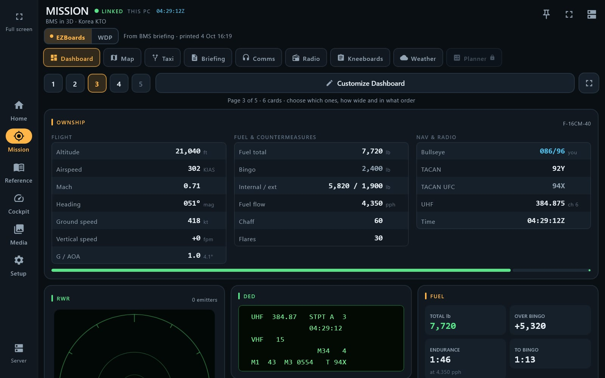 | 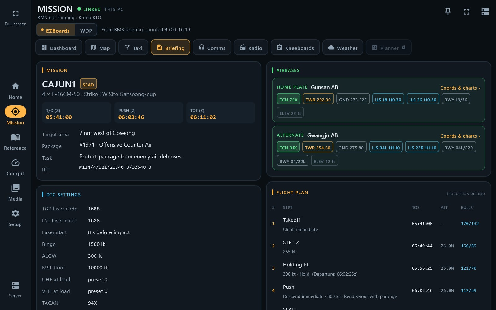 | 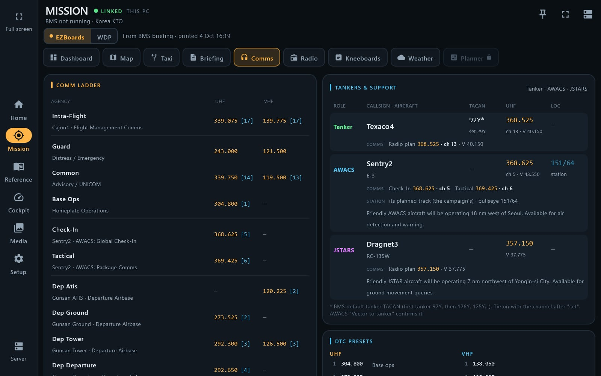 |

**Setting it up:** the [Quick setup](#quick-setup). In EZBoards mode the briefing and the route before 3D need **PRINT** in BMS (and a saved campaign or TE); in WDP mode the section is filled by **Populate from Planner**. Live traffic needs the two Tacview lines and ACMI recording (**F**).

### MFDs

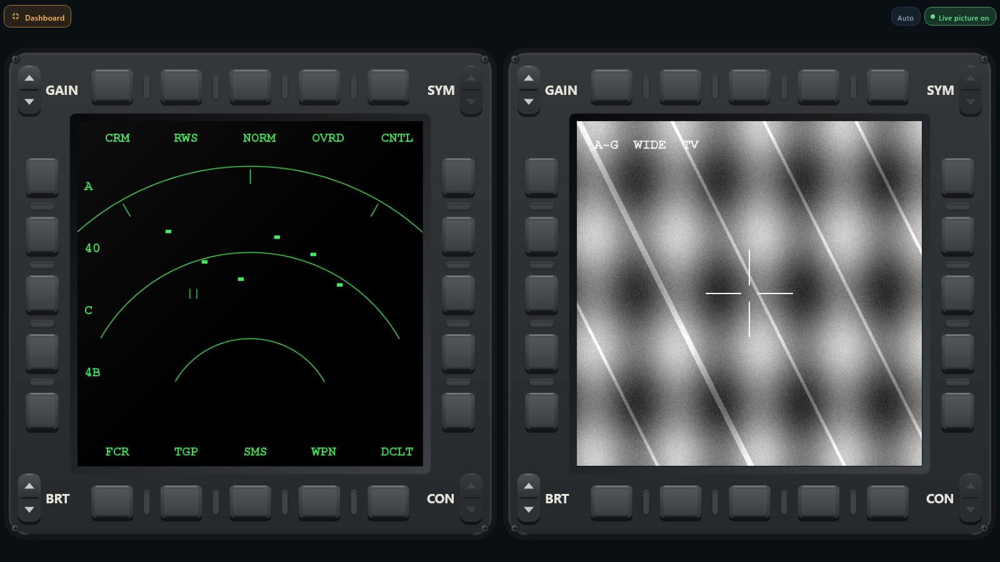

A Dashboard card with the live MFD pictures from Falcon BMS in an F-16 bezel. The 20 buttons and the BRT and GAIN rockers press BMS's own keys; SYM and CON have no BMS command and are shown inactive. Side by side or stacked, and a full-page view. There is no MFD VR board: in VR the cockpit's own displays are in view.

- **Setup:** in the Falcon BMS Launcher's main page, **Export RTT Textures → Enable**. Until pictures arrive the display states what is missing; **Setup → Cockpit displays** has the guide.
- **Administrator rights:** when Falcon BMS runs as administrator and BMS Companion does not, Windows blocks the key presses. Run both with the same rights.
- **Cost:** BMS spends a small part of each frame on the export. An unchanged display is not sent; **Live picture** off stops reading the pictures; the rate is selectable (5-30 per second).

### Taxi


**1,840 charted airfields across all 19 theaters, in the app.** Runways, every taxiway with its letter, hold short points, the pavement, the buildings, and every parking spot with the number BMS's Ground controller gives it ("park 04"). Each chart is generated from Falcon BMS's own files: the airfield data the sim taxis its AI on and, for the asphalt, the airfield's 3D model. Spot numbers and sizes are checked against the parking charts the theaters ship.

1. Open **Mission → Taxi** (or **Reference → Airfields → a field → Ground chart** for any field).
2. With Falcon BMS running, the page knows the field and the spot the jet is on.
3. Press the **RWY** button for the runway in use (BMS parks the jet on the half of the ramp nearest the active runway, so the spot usually decides it).
4. Pick the parking spot on the chart or in the list.
5. Read the clearance — *"Taxi to runway 09L via A. Hold short runway 09L."* — with the route drawn, the turn at each junction and the length of each leg.
6. After landing, **Taxi in** draws the way from the runway to the spot Ground gave, using the numbering Ground uses after landing ([docs/PARKING.md](docs/PARKING.md)).

With BMS's radio subtitles available, the page selects the runway and the parking spot from Ground's and Tower's calls ([Radio and automatic taxi](#radio-and-automatic-taxi)). Also: **Day/Night** chart, zoom by wheel, pinch or buttons, taxiway letters where BMS places its signs, and labels that step aside rather than overlap.

**What a spot shows**, in the shapes of BMS's own parking charts:

| On the chart | What it means | Where it comes from |
|---|---|---|
| Number in a **circle** | a stand for a small aircraft | the point type BMS gives that stand |
| Number in a **square** | a stand with no size limit | the point type BMS gives that stand |
| **Red** number (a muted brick red), red outline on the stand | the **alert cell**, kept ready for a scramble | the group number BMS puts those points in |
| Filled bay with a domed back | under a **hardened shelter or hangar** | the shelter or hangar the field itself stands on that spot |

The spot list uses the same shapes and colours, and the clearance names them: *"Start on spot 05 — hardened shelter."*

**Carriers.** Nineteen ships are drawn from the 3D model Falcon BMS flies: outline and sponsons, the angled landing area, wires, catapults and blast deflectors, ski jump, lifts, island and hull number. With ACMI recording on, the jet is shown at its position on the deck, following the ship. A carrier page has no ramp, runway buttons or taxi route, since a ship steams into wind.

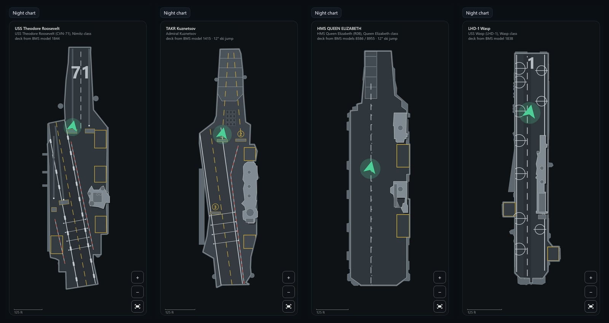

**Setting it up:** nothing; the charts are in the app. The jet's position and the runway in use come from Falcon BMS through the PC.

### Radio and automatic taxi

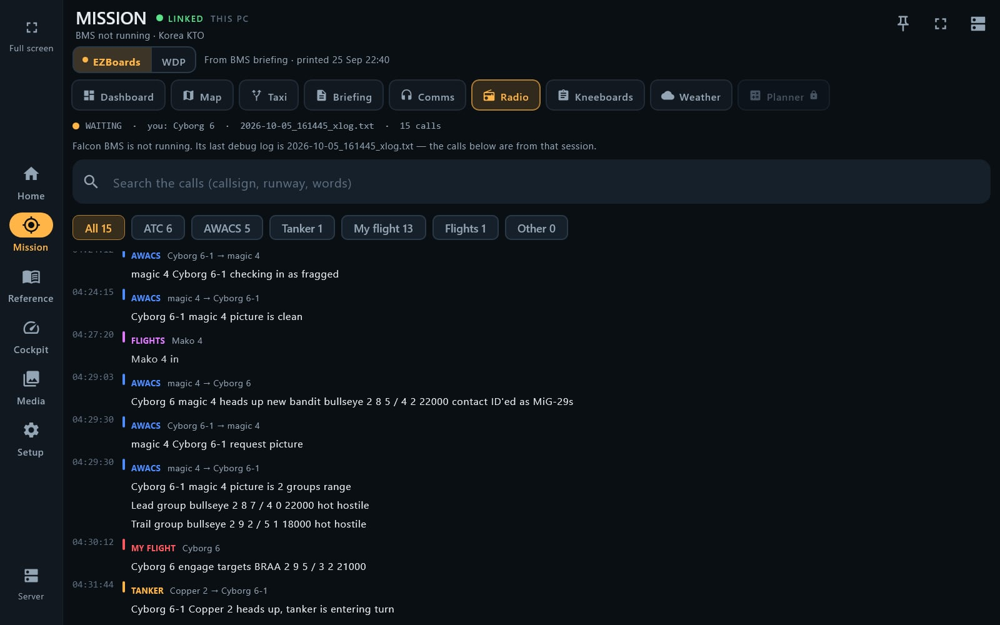

With Falcon BMS's debug mode on, BMS writes its radio subtitles to a debug log, which the PC reads.

- **Radio** (Mission tab): every radio call of the session, grouped (ATC, AWACS, Tanker, My flight, Flights, Other), with sim time and search.
- **Automatic taxi:** the Taxi page and the Live taxi VR board follow Ground and Tower — the runway cleared to before departure, and the parking spot assigned after landing.
- **Delete old debug logs** (Setup, off by default): moves older debug logs to the Recycle Bin, keeping a chosen number of recent sessions.

**Setting it up:** turn on debug mode in the BMS Launcher (or the Alternative Launcher) and tick **Display Radio Subtitles** (BMS SETUP → SIMULATION). Without them, nothing changes.

### Kneeboards page

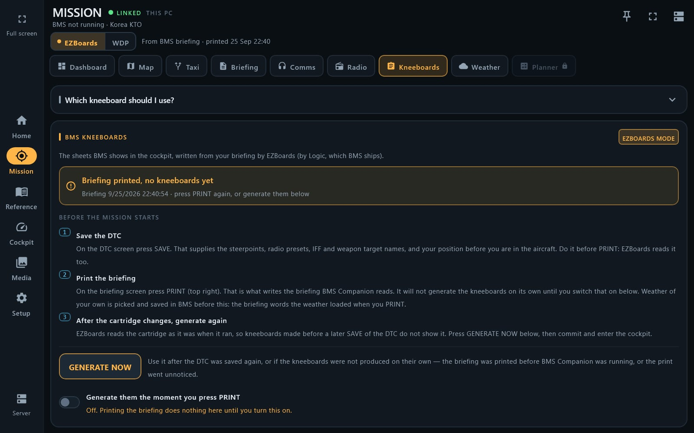

Generates BMS's cockpit kneeboards with EZBoards from any device (the console runs hidden on the PC; the result and the log come back), states which tool writes the cockpit pages in the current mode, sets up the [VR boards](#vr-kneeboards), and shows the pages UOAF's HTML Briefing tool exported. See [Which kneeboard is which](#which-kneeboard-is-which).

**Tankers and support** (a Dashboard card, and on Briefing and Comms): every tanker, AWACS, JSTARS and FAC with role, callsign, aircraft, TACAN (and the channel to tie on), UHF with its preset, location and the briefing notes. Planned tanker and AWACS tracks are read from the campaign file the mission is flying.

## Two modes: EZBoards or WDP

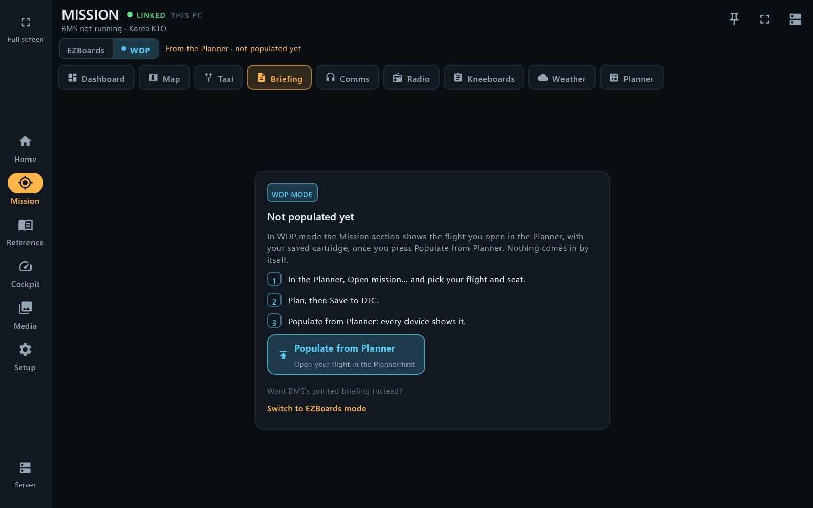

A switch at the top of the Mission section (and in **Setup**) decides where the whole section — Dashboard, Map, Taxi, Briefing, Comms, AWACS, Kneeboards and the VR boards — gets its data. It is kept on the PC, so every device shows the same mode.

| | **EZBoards mode** (the default) | **WDP mode** |
|---|---|---|
| **Pick it when** | you plan in BMS and want the app to follow BMS's briefing, as it always has | you plan in the Planner (WDP) and want the app to show that plan |
| **What fills the Mission section** | the briefing BMS prints, when you press **PRINT** in BMS, and your cartridge | the flight you open in the Planner and your cartridge as saved, when you press **Populate from Planner**; when BMS printed a briefing of that same flight, the Briefing is exactly that printed briefing, so one flight reads the same in both modes |
| **Cockpit kneeboards** | EZBoards, at PRINT or with **GENERATE NOW** | the Planner's **Upd Kneeboard**; GENERATE NOW and Run HTML Briefing are greyed out and EZBoards does not run at PRINT |
| **The Planner** | greyed out, with a lock | open |

**Switching** takes effect at once and can be reversed at any time; the last Populate stays on the PC and the EZBoards setting is kept. Switching into EZBoards mode opens the Briefing page.

**WDP mode updates only on Populate.** Until the first Populate, the Mission pages show *Not populated yet* with the steps; after changing the plan, press **Populate from Planner** again. The line under the switch names the source, for example "From BMS briefing · printed 22:40" or "From the Planner · populated 22:51 · Auto Save.cam · Viper1".

**Each mission starts clean.** Falcon BMS keeps lines, PPTs, targets and nav offsets in the cartridge until they are overwritten. When a new mission begins (a PRINT of another flight in EZBoards mode, another flight opened or populated in WDP mode), the PC removes from the cartridge and the TE's mission file what the Planner saved for an earlier flight, if unchanged since, including the last attack's nav offsets. A mode switch does the same and restores BMS's own cockpit kneeboard pages where the other mode's tool wrote them for an earlier flight. Values changed since by BMS or the pilot are kept. [docs/DATA-STORES.md](docs/DATA-STORES.md) lists what each mode reads and what is reset.

## Maps

The Mission map, the VR map board and the Planner's Map page draw the same mission picture:

- **Route and steerpoints**, before 3D too (from the mission file BMS writes beside the save, or the save itself when it provably holds the briefed flight).
- **Tanker and AWACS tracks** as the box about the leg they hold on, without their transit legs.
- **The mission's threats**: the sites the printed briefing's threat analysis names, placed from the save, ringed in one red on every map (friendly SAMs blue), plus the cartridge's PPTs. Sites the side has not spotted are never shown.
- **The flight's own airfields** (departure, arrival, alternate); **All airfields** shows the rest. Bullseye, DTC lines, and the attack (VRP or VIP, pull-up point, offset aimpoints).
- **Live traffic** in 3D from BMS's Tacview stream: your own side by default. **Hostile contacts are off by default** and appear only with **Setup → Show hostile contacts (live)**; **Friendlies** and **Hostiles** are independent map switches.

Tap anything for BRAA, bullseye and aspect, or to open an airfield. Every map also has **+ / −** buttons besides pinch, double-tap and a smooth mouse-wheel zoom, and a **Map** menu:

- **Four styles** — **Relief** (shaded terrain from the BMS heightmap), **Satellite** (the sim's own ground texture), **Dark** (muted, for a busy picture) and **Chart** (light, paper-like). All four line up exactly: switching never moves anything.
- **Zoom levels** — an overview, then sharper tiles as you go in, up to 8192 px across a theater (~125 m per pixel on the 1024 km theaters). All of it ships in the apps.
- **Landmarks** — country borders with names, provinces as faint dashed lines, and towns as dashed circles (cities, then towns, then villages as you zoom; labels never overlap).
- **Towns → Mission** (the default) — only the towns that matter: those the briefing names, the nearest town to each steerpoint, target, threat and airbase, and the larger towns on your route. The **target town** gets a solid amber ring and a bold name.

Borders and names come from Natural Earth, projected with each theater's own projection out of `NewTerrain/Theater.txt` and checked against real airport positions (median error under 0.4 nm).

**Setting it up:** nothing — the maps are in the app.

## Which kneeboard is which

Several things around BMS are called a kneeboard. Three of them can write the one on your knee in the cockpit, onto the same sixteen page files, and each takes a snapshot, so the **order** matters.

| What | Where you see it | What makes it |
|---|---|---|
| The **cockpit kneeboard** | in the pit, on your knee | **EZBoards** at PRINT in EZBoards mode (page 1 as it is set up), the Planner's **Upd Kneeboard** (pages 1 and 2 in WDP mode, where EZBoards is paused; the first pages EZBoards does not claim, 2 and 3, in EZBoards mode — or any you pick), and the **HTML Briefing** tool when it exports (pages 1-3; paused in WDP mode). Whichever wrote a page last is what you see; Upd Kneeboard shows who made each one |
| **HTML Briefing** pages | this app, and OpenKneeboard | UOAF's HTML Briefing tool (a separate download; looked for in `Tools\html_brief_win`), reading the campaign save and your DTC |
| **VR boards** | OpenKneeboard, in the headset | this app — live, and never stale |
| **App pages** | phone, tablet, browser, PC | this app |

**Weather first, in either mode:** if you want weather of your own, make it on the **Weather** tab, then in BMS pick it (Weather → Map Model → **`BMSC <name>`**, MAPS AUTO UPDATE on for a series and off for one map) and save it (**SAVE WTH** in a TE, the campaign save in a campaign) before anything below reads it.

**In EZBoards mode:** plan and **SAVE** the DTC in BMS, press **PRINT** in BMS (EZBoards runs if it is set to), press **GENERATE NOW** on the Kneeboards page if the DTC was saved again after it, export in HTML Briefing if you use it, then commit and enter the cockpit. Changed the weather after PRINT? Save it in BMS and PRINT again (and GENERATE NOW if kneeboards are not made at PRINT).

**In WDP mode:** in BMS pick your flight, **SAVE** the DTC and the mission, and **PRINT**; in the Planner **Open mission…**, plan and **Save to DTC**; **LOAD** in BMS's DTC window; **Populate from Planner**, **Upd Kneeboard**, then commit and enter the cockpit. Changed the weather after that? Save it in BMS, **Open mission…** the same flight again, then **Upd Kneeboard** and **Populate** again.

BMS reads the pages as you enter the cockpit, so anything made while you are in it shows the next time. Leave *HTML Briefings* unticked in BMS — the HTML Briefing tool does not need it, and turning it on costs you the text briefing EZBoards and this app both read. `docs/KNEEBOARDS.md` has the long version.

## VR kneeboards

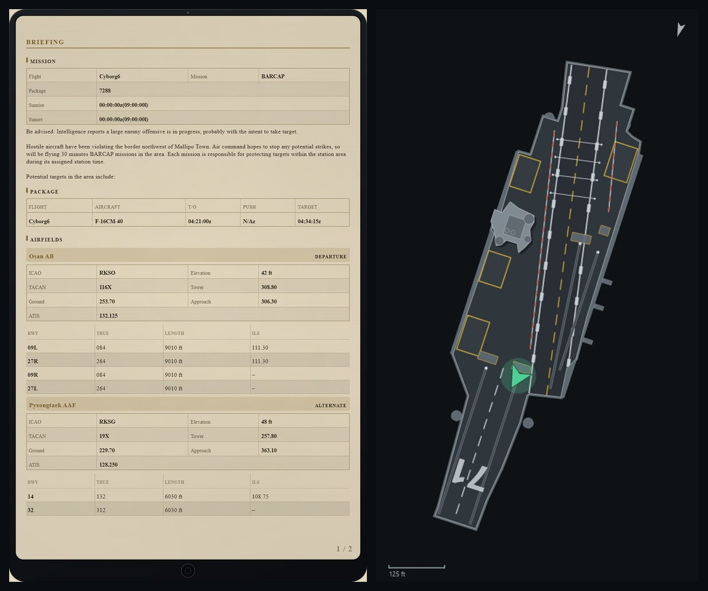

The browser version doubles as an **OpenKneeboard web dashboard**, laid out for a board a few hundred pixels across: the content fills it, and a ☰ and ⋯ float in a corner and fade when the mouse stops. Each board is its own address, so several tabs can show different things. The boards follow the Mission section's mode and the **Show hostile contacts (live)** setting.

**Board kinds:** live map · **Live taxi** · **Ground chart** · briefing · comms · HARM table · instrument charts · the exported HTML Briefing · the Dashboard.

- **Live taxi** draws the field you are **actually standing on**, briefed or not, with your jet on it and what is ahead of you up the page. **Its pages are zoom steps** — the *next page* / *previous page* buttons you already have bound zoom the chart from the whole field down to a couple of stands either side. There is no mouse in VR, so a bound button is the only control there is.
- **Ground chart** is one page per runway end, to read before start-up or on the way in, with your own position marked.

Because OpenKneeboard stops at the last page it was given, every board lays down a run of pages and cycles through them, so a bound button always has somewhere to go. Print size and board shape are on the ☰ menu.

**Setting it up**

1. Install [OpenKneeboard](https://openkneeboard.com) (and the WebView2 runtime if Windows asks).
2. In BMS Companion on the PC: **Mission → Kneeboards → VR boards**. Choose what each board shows and press **Configure** on a row for its options (day or night chart, which way up, how much of the field fits).
3. In OpenKneeboard, add a **Web Dashboard** tab per board and give it `http://<your-pc>:47474/kneeboard/1` — then `/2`, `/3`, … for the rest. The page names its own tab.
4. Bind next/previous page in OpenKneeboard if you have not already. That is how you flip boards and zoom the Live taxi chart.

## Weather generator


A Mission tab that writes Falcon BMS weather maps of its own beside BMS's. Nothing is written until it is enabled; BMS's own maps (and the update maps a series would replace) are first copied **inside the BMS folder** with a note on restoring them by hand, and everything written can be undone from the page (**Remove** for a map, **Restore update maps** for a series).

The model is **WeatherGen**'s (Craig Andera's tool from Virtual Mission Tools, ported under its MIT licence): moving highs and lows, BMS's four weather types placed by pressure, wind that follows the systems and veers with height, and cloud, visibility and temperature that follow the fronts. Results match WeatherGen cell for cell, except for three WeatherGen errors that are corrected (chiefly wind aloft turning the long way round).

1. **Mission → Weather**, pick your theater at the top of the page (it opens on the one BMS is running), and press **Back up this theater and enable** in the Save panel.
2. Pick a **preset**: Clear high pressure, Summer fair, Frontal day, Low cloud and drizzle, Afternoon storms, Winter, Desert haze. Or set the parameters, type weights and seed yourself.
3. Look at it: colour the cells by type, pressure or temperature, overlay wind barbs, cloud or visibility, and **Step** or **Animate** through time. Tap a cell, or type an airfield, for its forecast.
4. For a storm where you want one, long-press the map to place an **override region**, drag it into place, and let it fade in and out over time.
5. **Save map** writes `BMSC <name>.fmap`, which BMS lists under Weather → Map Model beside its own. **Save series** also writes an update map every step, which BMS loads through the mission with MAPS AUTO UPDATE on; BMS's own hourly update maps still load around it, so start it at your mission's own hour (**Mission clock**).
6. **In BMS**, with the campaign or TE loaded (save a TE once first): Weather → WEATHER tab → Weather Model: **Map Model** → click **`BMSC <name>`** → **MAPS AUTO UPDATE** on for a series, off for a single map → **SAVE WTH**, then save the TE or campaign. Until you do, nothing changes: a campaign flies BMS's own four-type weather and reads no map. Do it before PRINT and before the Planner's **Open mission…**, which read the weather BMS has loaded and saved. Saving the same map again on the tab does not change a mission that already saved it: pick it and save again.

**Each theater keeps its own settings**, on your device, so switching theater never lays one theater's weather over another; a theater you have not touched opens with the settings of the map you last saved for it. **To change several override regions at once**, Shift- or Ctrl-click their numbers on the map (on a touch screen, **Select several**), or tick them in the region list. **Open**, beside a map the app wrote, brings back the settings it was made from. Every theater BMS has is listed, the Korea 2012 theaters and LKTO Papa included, and Hellas, Hellas WCP and LHTO too (they ship none of BMS's ready-made maps, so a map there gets BMS's usual 59 x 59 grid).

BMS's own ready-made Sunny, Fair, Poor and Inclement maps are never changed. `docs/WEATHER.md` has the file format, what the port fixes in WeatherGen, and what is still unknown.

## Planner: WDP for Falcon BMS 4.38.1

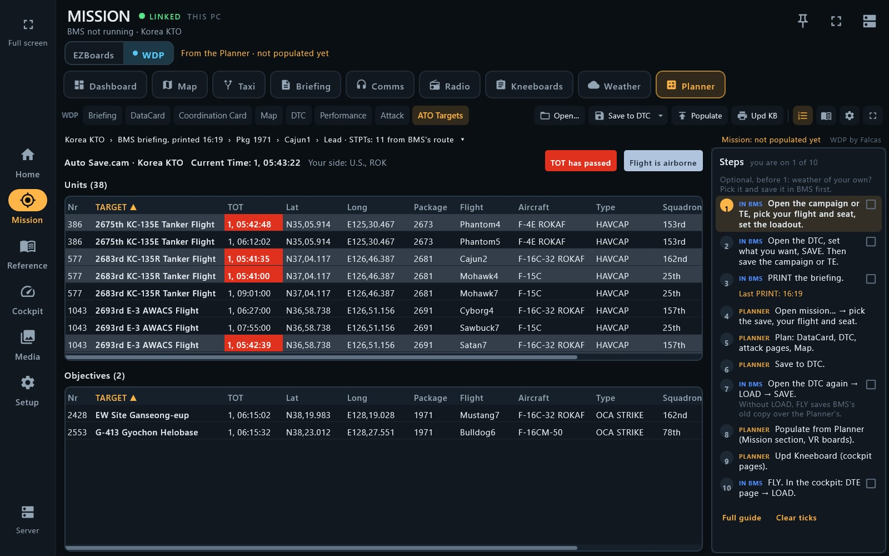

The Planner is a port of Falcas's Weapon Delivery Planner (WDP) to Falcon BMS 4.38.1; its pages, attack geometry, ballistics and performance planning are his work. The port keeps WDP's pages and controls in their places and uses BMS 4.38.1's own data (airports, runways, ILS, TACAN, charts, HARM codes, PPT types, radios, theaters, aircraft, stores, pylons and racks) in place of WDP's tables. It runs on the PC, on Android and in the browser, in **WDP mode** ([Two modes](#two-modes-ezboards-or-wdp)). What is the same as WDP 3.7.24, what is corrected and what is new is listed in the [1.3.8 release notes](CHANGELOG.md) and, in full, in [docs/WDP-PORT.md](docs/WDP-PORT.md).

**From BMS to the cockpit** (switch the Mission section to **WDP** first, at its top or in Setup)

1. **In BMS:** open the campaign or TE, pick your flight and seat, set the loadout.
2. **In BMS:** open the DTC, set what you want, **SAVE**; then save the campaign or TE.
3. **In BMS:** **PRINT** the briefing.
4. **Open mission…** — your saves, grouped by theater, newest first. Pick yours, then your flight and seat in **Pick a flight**, and **Plan this flight**. It asks WDP's question "Did you save Precision STPT in the DTC for THIS flight in BMS?": **No** (the default) plans every steerpoint from the save, **Yes** from your cartridge, and from the mission file where your cartridge's slot is empty.
5. **Plan** on the pages you need: DataCard, DTC, Attack, Map.
6. **Save to DTC**.
7. **In BMS:** open the DTC again, **LOAD**, then **SAVE** (without LOAD, FLY saves BMS's old copy over the Planner's).
8. **Populate from Planner** — the Mission section and the VR boards show your flight on every device.
9. **Upd Kneeboard** — your cards on the cockpit kneeboard.
10. **FLY**, and **LOAD** on the DTE page in the cockpit.

The toolbar's **Steps** button opens these ten steps beside the page and marks the current one. The **Guide** covers each step and each page, and can be read without the PC.

| Page | What it does |
|---|---|
| **Briefing · DataCard · Coordination Card** | WDP's card: airbases (TACAN, elevation, runway into the wind, ILS, tower), flight and package, flight plan with times, headings, distances, speeds and fuel, targets, tankers and AWACS, Link 16 STNs, comm card, ATIS and take-off figures. Without a printed briefing of the flight, situation, intel, ROE and emergency procedures are worded from the save as BMS words them; only the comm ladder needs PRINT. Weather comes from the save's weather file (`.twx`), or from the printed briefing of the same flight when newer; **Reload WX** reads a weather map (`.fmap`) or weather file. The chart buttons open the airport diagram and instrument charts |
| **Map** | Your cartridge on the theater map the way the HSD will show it, beside what the mission knows and the cartridge does not carry (tracks, threats, your fields). Tap one to add it as a line, a PPT or a steerpoint; an **HSD preview** shows it at the HSD's ranges |
| **DTC** | All sixteen tabs of your own cartridge, each with its Change window. **From mission…** fills a tab from what the app knows: tanker and AWACS tracks as lines, the spotted air defences as PPTs, the flight plan, targets, the comm plan, a TACAN or an ILS, laser codes, HARM tables |
| **Attack** (Pop-up · HADB · TOSS) | One tab with a rail to switch profile. WDP's controls and drawings: pull-up point, offset aim points, VRP/VIP figures for the DED, target-in-HUD check, coordinates as BMS gives them, and the map around the target. **TGT STPT** selects the target and, in VIP mode, **IP STPT** the IP (by default the steerpoint before the target; VRP needs none). **IP STPT at the VRP** places a steerpoint at the VRP and plans the attack as VIP from it. **Save to DTC** on an attack page also fills the DataCard's Delivery section, so the card and the cartridge agree. The attack last changed is drawn the same way on every map. Target elevation comes from BMS's height map; every ELEV can be typed |
| **Performance** | Take-off, climb, cruise and refusal figures from WDP's own engine tables, with BMS's pylons and racks under your stores and the mission's weather. Pick any F-16 **Type**, and load it in the **Loadout** window (a card per hardpoint; every store in a grouped list with search, then a station — or a station, then a store —, Mirror, the totals, Cancel and Apply; its OK fills the DataCard's Config rows) |
| **ATO Targets** | WDP's ATO Target List: every target your side's flights are tasked against in the save, in Units and Objectives lists with WDP's twelve sortable columns and real latitudes and longitudes |

| DataCard with the Steps panel | Map page | DTC (RADIO/NAV tab) |
|---|---|---|
|  | 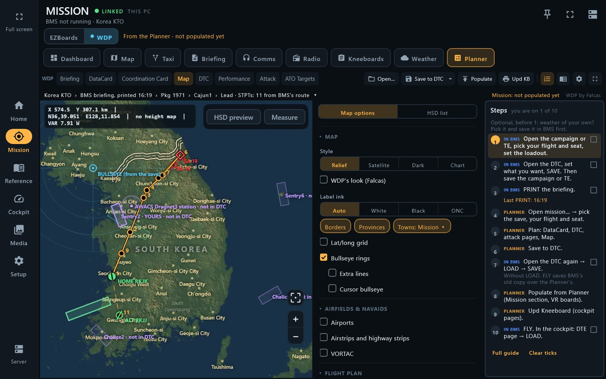 | 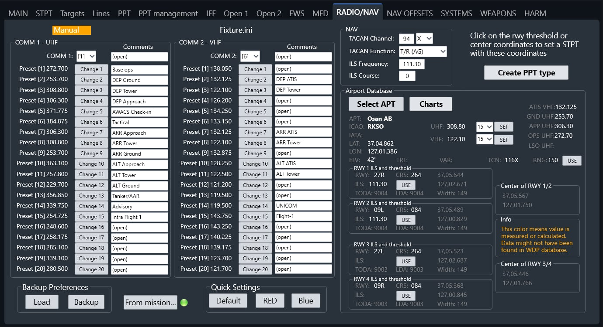 |
| **Attack: Pop-up, with the HADB/TOSS rail** | **Attack: Pop-up profile** | **Attack: TOSS** |
| 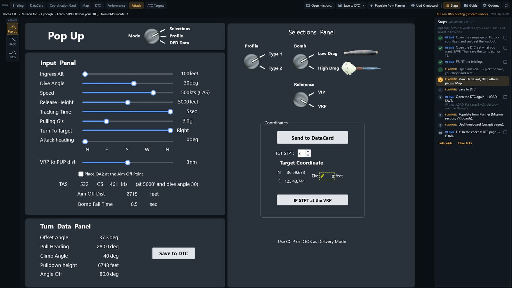 | 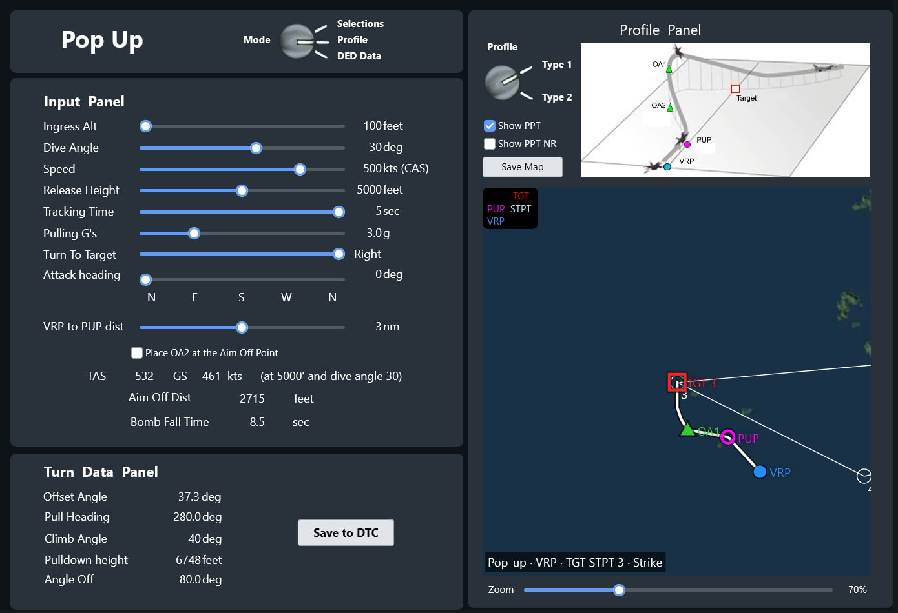 | 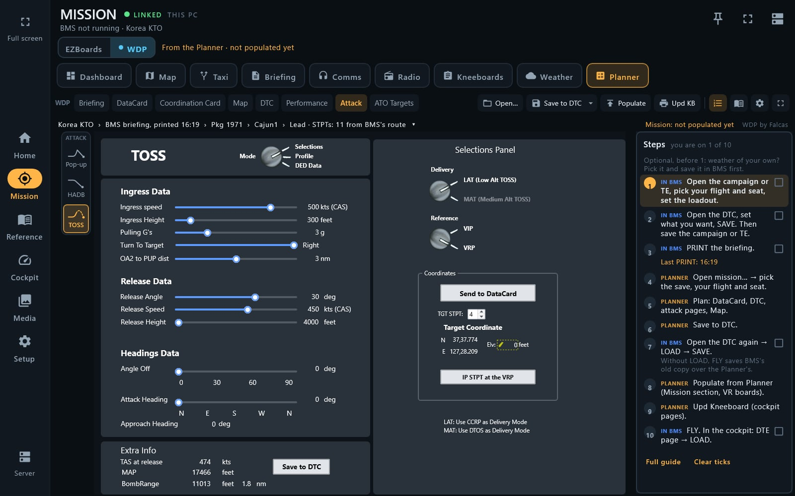 |
| **Performance** | **Loadout window** | **Upd Kneeboard** |
| 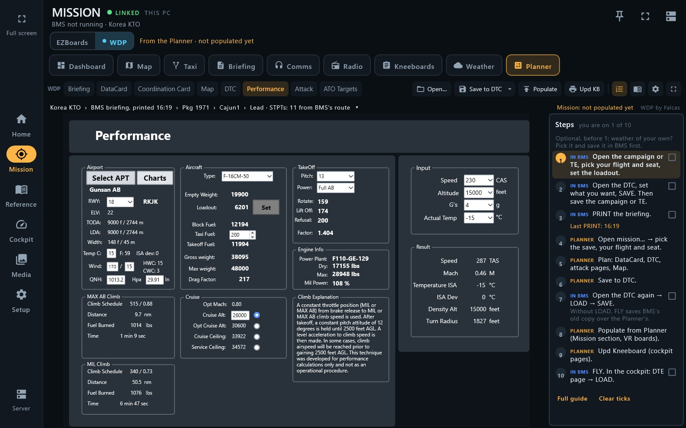 | 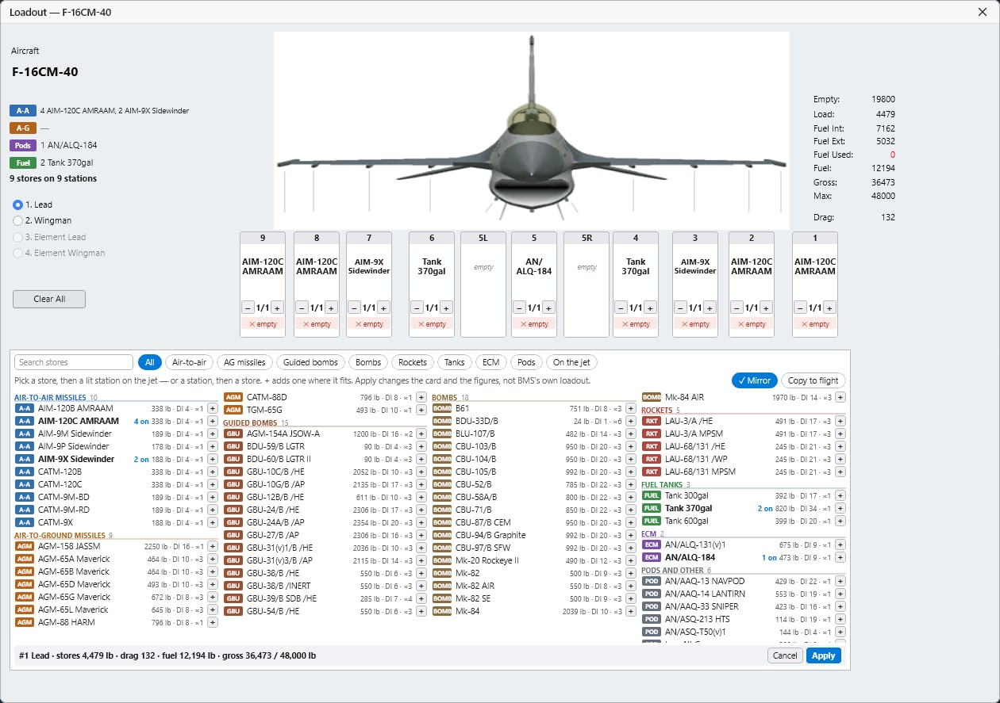 | 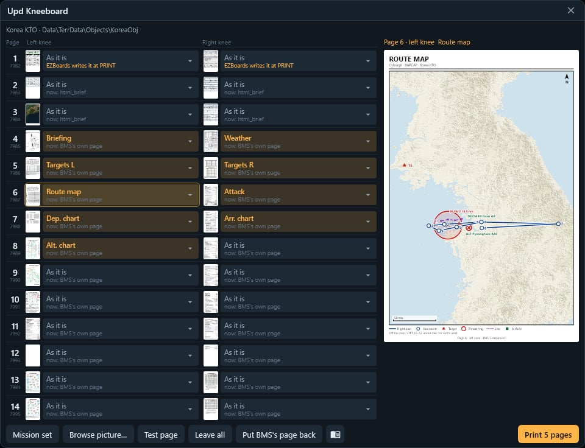 |
| **Pick a flight** | **Guide** | |
| 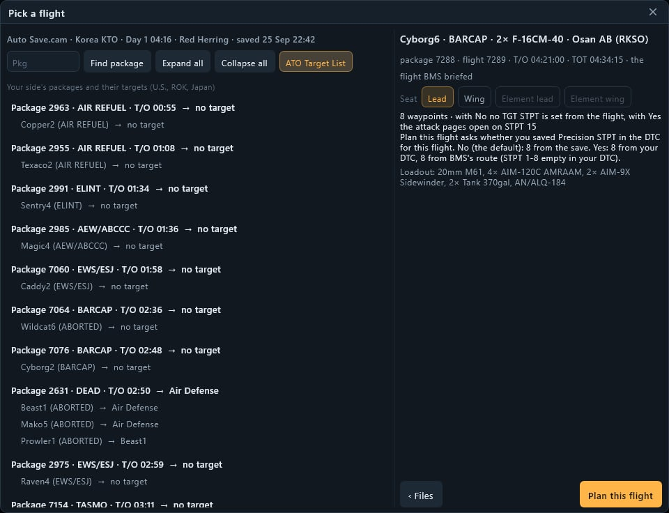 | 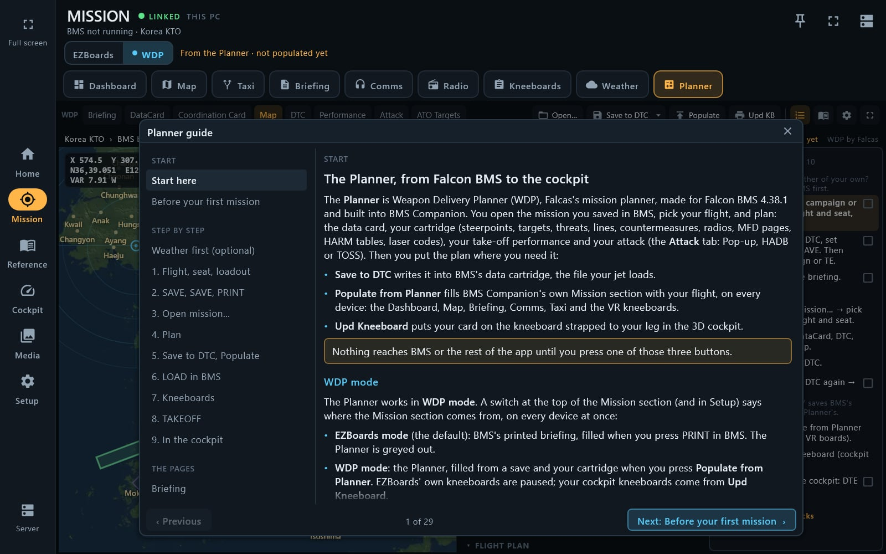 | |

The DataCard stays on the flight you plan: the package's other flights are greyed, your own callsign opens the Loadout window, and another flight is planned with **Pick a flight** (the card's **Different Flight** opens it).

**The toolbar**, the same on every page: **Open mission…**, **Save to DTC** (with how many edits are not saved yet; its menu has **Re-read DTC from BMS** and **Save to DTC and populate**), **Populate from Planner**, **Upd Kneeboard**, then **Steps**, **Guide**, **Options** (**Settings…** — the folders the Planner uses, Show tooltips, Auto load last mission — and **About WDP**) and **Full window**. With a mouse every tab and button is in view from a 1024-pixel window up. Under it, a strip says what you are planning, from which save and seat. Rest the mouse on any control (or hold a finger on it) for a line on what it does.

**File buttons always work on the BMS PC**: Windows' own Open/Save dialog in the PC's window, a folder browser on a phone, tablet or browser. Files use WDP's formats, so either program opens the other's files. They are kept in `User\BMS Companion Planner` inside the BMS folder, laid out like WDP's program folder (`Files\…`, `SavedMaps`, `DataCards`; the DataCards folder can be moved, as in WDP). The cartridge stays in `User\Config`. BMS reads nothing from the Planner's folder; only the cartridge and the kneeboard pages reach the jet.

**What it writes, and what it never writes.**

- **Save to DTC** writes your cartridge, `User\Config\<callsign>.ini`, the way WDP does: straight away, with no question and no backup copy, and only the lines you changed touched. With a Tactical Engagement open (your own or one BMS ships), it also writes that TE's mission file, in place, because BMS loads it over your cartridge.
- **Upd Kneeboard** writes the cockpit kneeboard's page files you choose, in BMS's own format, in place with no backup — a page is made again whenever you like, and **Put BMS's page back** restores BMS's own.
- **BMS's campaign starts are never opened or written** (Save0, Save1 …, Te_New, Instant: the files the campaigns and TEs begin from). Every other save opens and saves as it does in WDP.
- **Populate from Planner** writes nothing into BMS: the snapshot is kept in BMS Companion's own settings on the PC.
- **The file buttons** write only where you save in their window, and only WDP's own kinds of file (`.bdc`, `.ini`, the DTC backups, `.ppi`, `.jpg`); a file that is there already only after you said Replace. **Save Callsign.ini File** writes the cartridge you pick directly, as WDP does.

**On a phone, a tablet or in a browser** the Planner works through the PC and requires a linked device. By finger, a text box is edited in a bar above the keyboard (name, value, − / +, **Next**, **Done**), lists and sliders open as large editors, and a double tap zooms.

Calculations are compared with WDP itself and agree, except where WDP was wrong. Fixed WDP issues include: BMS 4.38 weather files that WDP cannot read, training missions that did not load, ILS frequencies forced to 109.00, wrong HARM codes, IFF codes losing leading zeros, swapped TOSS bearings, pressure altitude with the wrong sign, and Clear All removing Recon targets without asking. WDP's Threats and Munition pages are not included; the Threat Guide and Arsenal cover them. `docs/WDP-PORT.md` is the full record.

**Setting it up:** switch the Mission section to **WDP**, and link the device to the PC.

## Config: Falcon BMS's own settings

Falcon BMS keeps several hundred settings in a text file its own screens never show you. This section lists all of them, says what each one does, and writes only the ones you change.

**It is off until you ask for it:** **Setup → Mission pages → Show the Config section**. It then appears as a section of its own, on the PC, in the browser and on a tablet alike — so you can change a setting from the sofa for the flight about to start.

**How to use it**

1. Turn it on in Setup, then open **Config**.
2. Press **Click to Back Up and Enable**. Your `Falcon BMS User.cfg` is copied into a `BackUp` folder beside it. That copy is taken **once and never replaced**, so there is always a way back to exactly what you had.
3. Three profiles are laid down at the same time. **Profile 1** is a copy of what you already had; **2** and **3** start empty, which in a config file means every setting at its Falcon BMS default.
4. Pick a file (**User**, or **VR** if you fly in a headset) and a profile, and change what you like: switches for switches, a list for the settings that take named choices, a box for the rest.
5. **Search** by name or by what a setting does. The box never scrolls away, and the group you are looking at stays under it.
6. **⋯** makes a profile the one BMS reads, copies one profile into another, or puts a profile back to your original file.

**What it shows.** The settings your file actually holds are listed **first and marked**; everything else is shown dim at its default. Change one and it moves up into the first list — which is exactly what it does in the file, because a setting left at its default is not written at all. The 219 settings are grouped (VR, graphics, terrain, cockpit and avionics, views, sound, multiplayer, campaign) and described in BMS's own words, read out of the stock config your version ships with.

**What it never touches.** The lines your BMS launcher writes at the end of the file: they are shown, carried across untouched when you switch profiles, and anything new is written above them. Nothing outside `User/Config` is written, and no file is written over in place — the new one is written beside it and moved across, so a failed write can never leave you with half a config.

> These are Falcon BMS's own settings and a wrong one can stop BMS starting. That is what the backup is for. The page says so in red, and it is meant.

## Media: BMS screenshots

The screenshots you take in Falcon BMS (`User\Pictures`, or `g_sPicturesDirectory`), on any device: a gallery grouped by day, a full-screen viewer with zoom and previous/next, multi-select, and **delete** — to the Recycle Bin on the BMS PC, so it can be undone.

- **Android:** Share to any app, or **Download to this device** (Pictures/BMS Companion).
- **Browsers (iPhone, iPad…):** Download, or the system share sheet, one or several at once.
- **PC client (laptop):** Download to this PC, copy to clipboard, save a copy.
- **On the BMS PC:** copy to clipboard, save a copy, open the folder.

**Setting it up:** nothing, once the device is connected. If BMS writes its screenshots somewhere unusual, point **Screenshots folder** at it in the PC's Falcon BMS settings.

## Reference: Airfields, Map, Threats, Arsenal

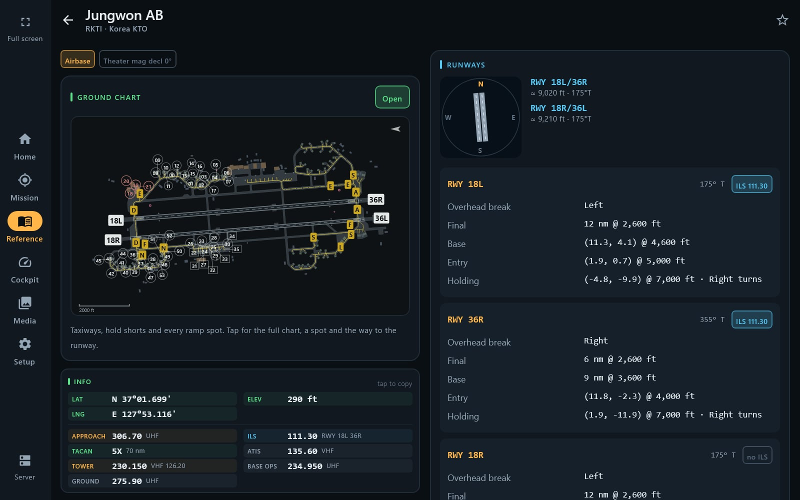

Works with no PC and no connection; it is all in the app. One section with four pages, **Airfields | Map | Threats | Arsenal**, and the theater picker beside them.

- **Airfields** — every field of every theater: the ground chart with the **Info** box under it (latitude and longitude as BMS shows them, elevation, and the field's frequencies in divert order; tap a value to copy it), then runways, ILS, ATC patterns, nearest diverts, navaids, and the instrument charts of the theaters that ship them (244 charts, 988 pages).
- **Map** — the theater map with its airfields.
- **Threats** — SAMs, AAA, radars, MANPADS, aircraft, AAMs and ships, with RWR symbols, HARM/ALIC codes and engagement envelopes, plus **HARM & RWR**, **Encyclopedia** and **Range chart**.
- **Arsenal** — 323 flyable aircraft types (KTO and every add-on), per-theater variants, specs, station-by-station loadouts with rack capacity, and 518 stores.

| Threats | Arsenal | HARM & RWR |
|---|---|---|
| 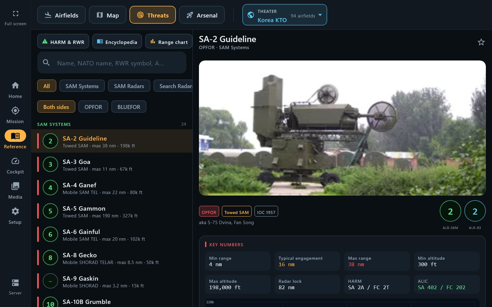 | 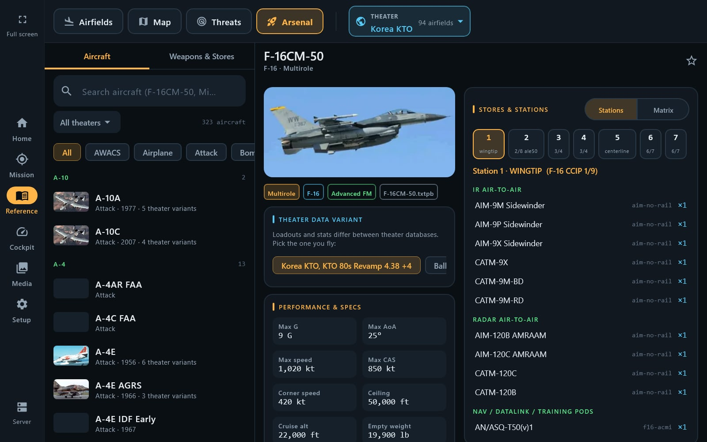 | 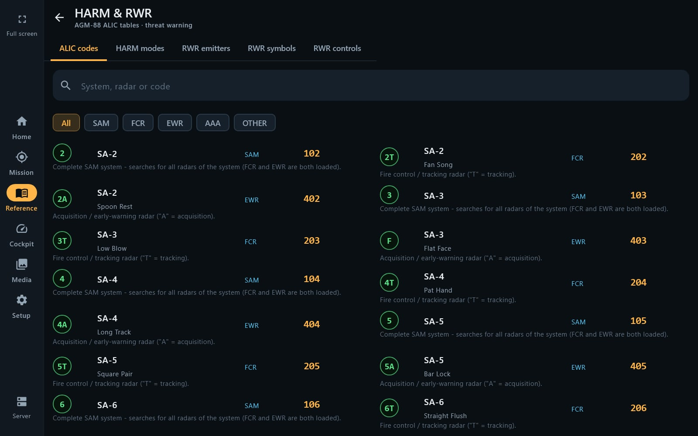 |

## Cockpit and training

- **HOTAS** illustrations for the F-16C/D and F-15C; tap a switch to see what it does.
- **Checklists** with check-off and **Previous / Next**; one Starting Engine checklist for the F-16 Block 40/42/50/52 with each engine's figures; a complete warning and caution light index with first actions and links to the procedures (F-16 and F-15C).
- **Comms and brevity**, calculators and converters.
- **Bullseye Trainer**: five game modes, three difficulty levels.
- **Global search** and favorites.

| HOTAS | Checklists | Bullseye Trainer |
|---|---|---|
| 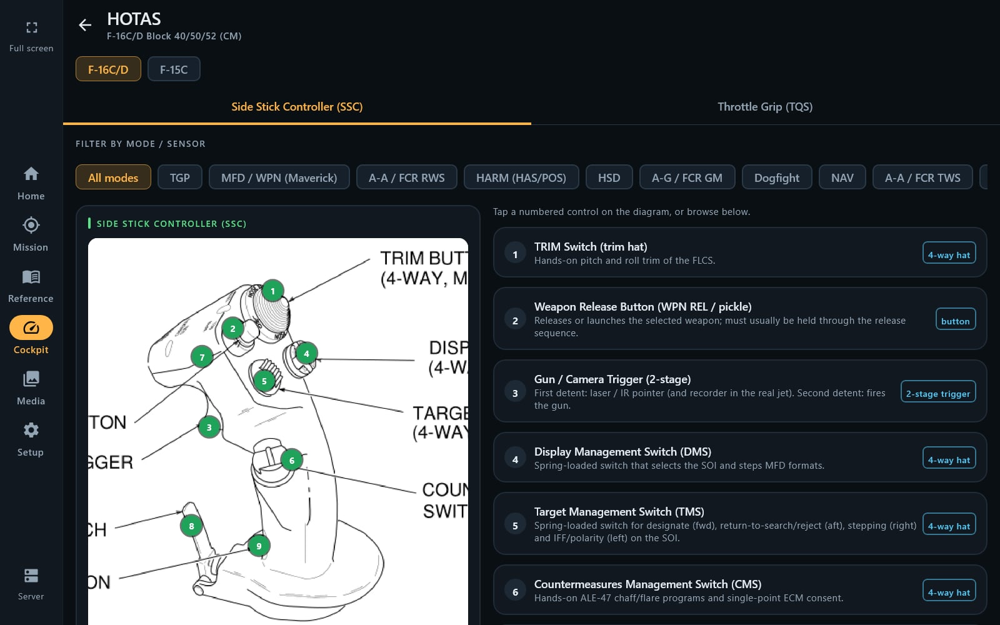 | 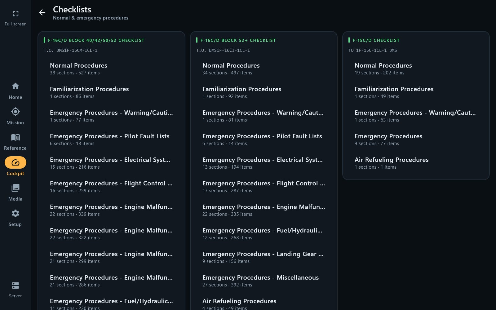 | 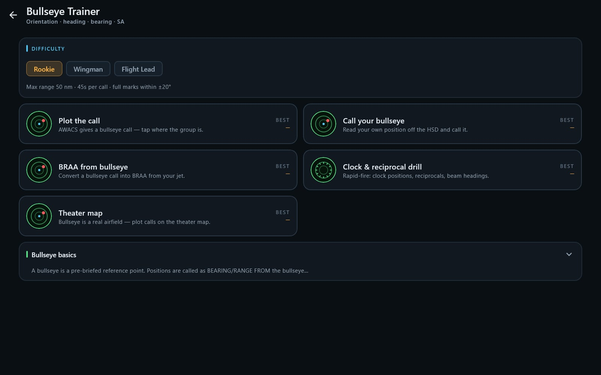 |

## BMS Companion for Windows

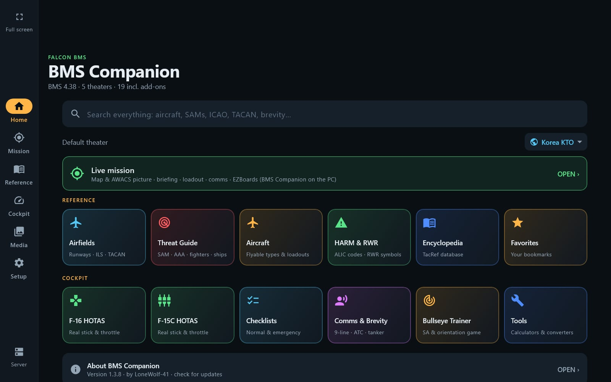

**One program, one window, two faces**, remembered between runs.

- **Server page** (first start) — one light page for a PC that serves your devices: live status (Falcon BMS, AWACS feed, briefing, connected devices), **Connect your devices** with the address and a QR code, the **setup checklist** with live ✓/✕ checks and a fix button for each step, Falcon BMS settings, recent activity and start-up options. The full app is not loaded, so it uses little memory.
- **Full app** — every section, with data from Falcon BMS on this PC or from the BMS PC over the network (**On another PC**, for a laptop). **Open the full app** on the server page and the **Server** button at the foot of the navigation rail switch between them in one click.
- **Borderless full screen** — **F11**, or the button at the top of the rail, fills the monitor the window is on. Esc or F11 to leave. The pin keeps the window on top.
- **Only one copy runs** — opening it again brings the running window forward, also from the tray.
- **Tray icon** — open, switch faces, browser access on/off, exit. Closing the window can keep it serving in the tray, and it can start with Windows.
- **Falcon BMS settings in the app** — BMS, EZBoards and screenshot folders, kneeboards on PRINT, the Tacview stream (host, port, password), network port, firewall rules in one prompt, and a button to edit `Falcon BMS User.cfg`.
- **PC extras** — mouse-wheel zoom on maps and charts, UI zoom with **Ctrl +/−/0**, dark title bar, remembered window size and position.

**If the window is slow.** Older graphics hardware often has no Direct3D 12 driver, and then every frame is drawn on the processor instead — which looks like a slide show. The **Graphics** card on the server page and on Setup has two levers:

| Setting | What it does |
|---|---|
| **Renderer: Automatic** | Direct3D. The right choice for anything recent, and the default. |
| **Renderer: OpenGL** | The one to try on an older Intel HD, or anything without Direct3D 12. |
| **Renderer: Software** | Drawn entirely on the processor. Slowest, but it works everywhere. |
| **Go easy on this machine** | Reads the jet once a second instead of four times, which is what drives the redrawing. Everything still works; the map just updates less often. |

The renderer takes effect the next time BMS Companion starts (the graphics context is built with the first window); the page says so. "Go easy" takes effect at once.

## Android and the browser


The same screens on every device, laid out for its width: phones get a bottom bar and single-column pages, tablets and PCs a navigation rail and side-by-side cards.

- **Android 8 or newer:** install `BMS-Companion.apk`; **Setup → Find BMS PC** links it to BMS Companion on the PC. The Reference, Cockpit and every ground chart work without a link. The screen stays on while the Mission section is open.
- **iPhone, iPad and any browser:** open the address on the PC's server page (or scan its QR code). The whole app runs in the browser as WebAssembly; the PC only sends data. **Share → Add to Home Screen** gives it an icon. Requires Safari 18.2+, Chrome/Edge 119+ or Firefox 120+.
- **By finger,** the Planner edits a text box in a bar above the keyboard, opens lists and sliders as large editors, and zooms with a double tap; the on-screen keyboard never resizes the app.

## Staying up to date

The app checks GitHub once, quietly, when it starts — nothing interrupts you. If there is something newer, a small badge appears in the corner and a dot on the About card. **About → Download** shows the release notes of every version between yours and the newest, downloads it with the rate and time left, checks it against the checksum the release publishes, and installs it: the MSI on Windows, the APK on Android. An interrupted download is resumed, not fetched again.

---

## What it writes to the BMS folder

BMS Companion reads the Falcon BMS install. It writes only these, each on a press of the relevant button:

| Feature | Writes | Safeguard |
|---|---|---|
| **Config** | `User\Config\Falcon BMS User.cfg` / `VR.cfg` and their profiles | off until enabled; the original is copied once into `User\Config\BackUp` with a note on restoring it by hand |
| **Weather generator** | new `BMSC <name>.fmap` maps beside BMS's own, and update maps for a series | BMS's ready-made maps are never changed; update maps a series replaces are copied first into `Campaign\BMS Companion Backup` and can be restored |
| **Planner: Save to DTC** | the pilot's cartridge, `User\Config\<callsign>.ini`, and with a TE open that TE's mission file | as WDP: directly, no backup, only the changed lines |
| **Planner: Upd Kneeboard** | the chosen cockpit kneeboard page files (`7982-7997.dds`) | each file keeps its format and the half not printed; **Put BMS's page back** restores BMS's original |
| **Planner: file buttons** | WDP's own files (DataCards, codewords, DTC backups, pictures) in `User\BMS Companion Planner`, or where saved | only WDP's file types; an existing file only after Replace |
| **New mission / mode switch** | removes what the Planner saved for an earlier flight from the cartridge and the TE's mission file, if unchanged since; a mode switch also restores BMS's own cockpit pages the other mode's tool wrote | values BMS or the pilot changed since are kept |
| **EZBoards** (EZBoards mode) | the cockpit kneeboard pages EZBoards writes | EZBoards' own behaviour |
| **Media / ACMI / debug logs** | moves deleted screenshots, cleared ACMI recordings and, when enabled, old debug logs to the Recycle Bin | recoverable from the Recycle Bin |

Every file is written beside itself first and then moved into place, so a failed write never leaves half a file. BMS's campaign starts (`Save0`…, `Te_New`, `Instant`) are never opened or written. [docs/DATA-STORES.md](docs/DATA-STORES.md) lists what each mode reads and resets.

## How it works

```
Falcon BMS (shared memory, briefing.txt, DTC .ini, campaign saves, Tacview RT stream, EZBoards, screenshots)
   │ read; written only where you ask (below)
   ▼
BMS Companion for Windows ──┬─ its own window: server page or full app (reads BMS directly)
   HTTP 47474, UDP 47475    ├─ Android app, client PCs: mission API (/api/…), discovery on UDP 47475
                            ├─ browsers: the web app (/) runs on the device, data from /api and /assets
                            └─ VR: /kneeboard/<n>, one OpenKneeboard Web Dashboard tab each
```

The Android app, the PC program and the browser version are built from the same Kotlin/Compose code, so every device shows the same screens. The browser version is that code compiled to WebAssembly: it runs on the phone or tablet like a native app, and the PC only sends it data.

## Where the data comes from

| Data | Source on the PC |
|---|---|
| Ownship, RWR, DED, steerpoints, PPTs, bullseye, theater, aircraft, TACAN | BMS shared memory: `FalconSharedMemoryArea`, `…Area2`, `…AreaString` (layout from `Tools\SharedMem\FlightData.h`) |
| Other aircraft (the AWACS picture) with speed, fuel and radar locks | BMS's own Tacview real-time telemetry server (`g_bTacviewRealTime`, port 42674) |
| Who is friendly, hostile or neutral | the campaign save's team table — Tacview reports the *country*, not the side |
| Briefing, package, loadout, comm ladder, weather | `User\Briefings\briefing.txt` (the PRINT button; honours `g_sBriefingsDirectory`) |
| A save's weather (the Planner's card, and the Mission section in WDP mode) | the save's own `<save>.twx` beside it, written when BMS saves the mission (SAVE WTH in a TE), and under Map Model the map it flies (`<save>.fmap`, or an update map in `WeatherMapsUpdates`) |
| Steerpoints, targets, PPTs, lines, radio presets | `User\Config\<callsign>.ini` (DTC Save), with PPT names from the theater's `Ppt.ini` |
| Planned tanker and AWACS tracks | the campaign file the mission is flying (`.cam`/`.tac`) |
| Which theaters exist, and where each keeps its campaign, objects and cockpit textures | BMS's theater definitions, `Data\TerrData\TheaterDefinition\theater.lst` and each `.tdf` |
| The Planner's **Open mission…**: saves, flights, routes, loadouts, packages, the briefing texts of a save | the campaign, TE and training saves in each theater's campaign folder (`.cam`/`.tac`/`.trn`), read only, with the theater's `Strings.txt` |
| Your route before 3D | the mission file BMS writes beside the save (`<save>.ini`), used only when it matches your briefing; else the printed flight's own waypoints in the save, when the save provably holds that flight |
| The mission's threats on the map | the printed briefing's Threat Analysis, placed in the save (only sites your side has spotted) |
| Radio calls, and the runway and parking spot ATC assigns | BMS's debug log, `User\Logs\<date>_xlog.txt` (debug mode, Display Radio Subtitles), read only |
| Parking spot numbers | BMS Ground's own count of each runway end's network, read from the sim's code (`docs/PARKING.md`) |
| The cockpit kneeboard pages (Upd Kneeboard) | the F-16's `7982.dds`-`7997.dds` in `KoreaObj` of the theater's 3D data folder; BMS's shipped copies in its `Docs` folder for **Put BMS's page back** |
| Ground charts: runways, taxiways, ramp spots, buildings | each field's own authored data, `ObjectiveRelatedData/OCD_nnnnn/` |
| Ground charts: the asphalt | the field's own 3D model, decoded from the game |
| Kneeboard tables | EZBoards `bin\xbrief.exe` (read-only, output to memory) |
| Screenshots | `User\Pictures` (or `g_sPicturesDirectory`); thumbnails made on the PC |
| The Config list | the stock `User\Config\Falcon BMS.cfg` your version ships with |
| BMS folder, pilot callsign, theater | Registry `HKLM\SOFTWARE\WOW6432Node\Benchmark Sims\Falcon BMS 4.xx` |

Everything bundled in the apps — aircraft, weapons, threats, airfields, charts, maps, ground charts — is produced by the extractor in `tools/extractor` from a real install, and checked against something the game itself publishes. [docs/DATA-SOURCES.md](docs/DATA-SOURCES.md) has a row per feature: the file it comes from, how the reading is verified, and what to look at when that file changes.

## Repository layout

```
app/                     Android app (Kotlin, Jetpack Compose, Material 3)
  src/main/assets/       extracted game data (JSON/WebP): ground charts, instrument charts,
                         maps/<theater>/<style> tiles, data/geo landmarks, data/cfg options
  src/main/java/com/bmscompanion/app/
    data/                models + asset repository
    data/airfield/       ground chart models and taxi routing
    data/mission/        mission client (HTTP polling, UDP discovery) and API models
    data/wdp/            the Planner's arithmetic: WDP's ballistics, attacks, engines, DTC and card
    ui/board/            VR kneeboard pages
    ui/screens/          reference screens, Airfields, Taxi, Config, Setup, Media
    ui/screens/mission/  Mission section: tabs, the mode switch, Dashboard, Map, Taxi, AWACS, Briefing, Comms, Kneeboards
    ui/screens/wdp/      the Planner: WDP's pages drawn from their layouts, its windows, the Map page, the Guide
    ui/screens/editor/   the Weather generator
desktop/                 BMS Companion for Windows (Kotlin, Compose for Desktop). Compiles app/src/main/java as-is, plus:
  src/main/kotlin/overrides/   PC versions of the Android-only files
  src/main/kotlin/shims/       stand-ins for the Android APIs the shared screens call
  src/main/kotlin/com/bmscompanion/desktop/
    Main.kt                    the window (server page or full app, full screen), tray, single instance
    PcConfig.kt, PcServer.kt   mode and services; the HTTP server (API, web app, bundled data, boards)
    bridge/                    reads Falcon BMS: shared memory, briefing/DTC parsers, Tacview client,
                               EZBoards, screenshots, campaign saves, and the Config file service
    ui/                        server page and settings cards
web/                     browser version (Kotlin/Wasm, Compose for Web), same shared code
pc/publish-desktop.ps1   builds dist/BMS-Companion-PC.msi and .zip, with the browser version inside
tools/extractor/         Node.js extractor: BMS install -> app assets (read-only)
tools/curated/           data transcribed from the BMS manuals, plus the carrier deck dimensions
docs/                    SETUP, PROTOCOL, DATA-SOURCES, DATA-STORES, UPDATING, KNEEBOARDS, PARKING, WEATHER,
                         WDP-PORT, screenshots
CHANGELOG.md             what changed in each version
CLAUDE.md                orientation notes for AI-assisted maintenance
```

## Building

**Requirements:** JDK 17 (with jpackage, for the PC installer), Android SDK (API 35), Node 18+ (extractor only). The browser build downloads its own Node.js, Yarn and Binaryen into the Gradle cache.

```bash
# Android app
./gradlew installDebug
./gradlew assembleRelease                                        # app/build/outputs/apk/release/

# BMS Companion for Windows (the browser version is built and packed in automatically)
./gradlew :desktop:run
powershell -ExecutionPolicy Bypass -File pc/publish-desktop.ps1  # dist/BMS-Companion-PC.msi + .zip

# Browser version on its own
./gradlew :web:wasmJsBrowserDistribution

# Regenerate the bundled data from a BMS install (read-only)
cd tools/extractor && npm install
BMS_ROOT="D:/Falcon BMS 4.38" node src/main.mjs        # aircraft, weapons, airports, ground charts, theaters
BMS_ROOT="D:/Falcon BMS 4.38" node src/airfieldrun.mjs # ground charts only
BMS_ROOT="D:/Falcon BMS 4.38" node src/charts.mjs      # instrument charts
BMS_ROOT="D:/Falcon BMS 4.38" node src/maps.mjs        # map styles and tile levels (~30 min)
BMS_ROOT="D:/Falcon BMS 4.38" node src/geo.mjs         # borders, provinces and labels
```

Release APKs are signed with the debug key so anyone can build and side-load them.

**PC program switches:** `--tray` (start in the tray), `--route <route>` or `BMSC_ROUTE=mission` (open a screen directly), `BMSC_PORT=<port>` (another port for this run). Developer checks: `--selftest`, `--dumpstrings`, `--eztest`, `--cfgtest`, `--api`, `--maprender`, `--updatetest`, the campaign-save checks (`--atotest`, `--trackstest`, `--teamtest`, `--sidetest`, `--theatertest`, `--camtest`, `--camdump`, `--camsource`), the Planner's (`--wdppagetest`, `--wdptypetest`, `--wdpclicktest`, `--wdprender`, `--plantest`, `--tesavetest`, `--dtcfromtest`, `--wdpmaptest`, `--missiontest`, `--samebrieftest`, `--ddstest`, `--kbprinttest`, `--planneroutcome`, `--filestest`, `--wdpfilestest`), the maps' (`--mappicturerender`, `--zoomtest`, `--taxirender`, `--deckrender`), the weather's (`--wxtest`, `--wxgentest`, `--wxrender`) and the MFDs' (`--osbtest`, `--mfdkeystest`, `--rtttest`, `--rttselftest`, `--mfdbench`, `--mfdrender`). A check that writes runs against a **copy** of a BMS folder; while one runs, the program refuses to write into a real install. `CLAUDE.md` lists what each takes. The browser version accepts `?route=mission`.

## Updating for a new BMS version

See **[docs/UPDATING.md](docs/UPDATING.md)** — a checklist written so it can be handed straight to Claude Code: re-run the extractor, diff `FlightData.h`, compare a fresh `briefing.txt`, check the add-on theaters, bump the version. [docs/DATA-SOURCES.md](docs/DATA-SOURCES.md) says, per feature, what to look at when a BMS file changes.

## Credits & licences

- Unofficial fan project, **not affiliated with Benchmark Sims**. Falcon BMS, its data, documentation, TacRef pictures, HOTAS illustrations and airport charts belong to Benchmark Sims and the respective add-on theater teams. This repository contains data extracted from the game install for personal reference use.
- **Weapon Delivery Planner (WDP)** is by **Falcas**. The Planner is a port of Falcas's Weapon Delivery Planner (WDP) to Falcon BMS 4.38.1; its pages, attack geometry, ballistics and performance planning are his work. Falcas is credited on every Planner page, in About and in the Guide; `docs/WDP-PORT.md` records what was ported and every fix.
- **EZBoards** is a separate tool by Logic, available from the Falcon BMS forum; BMS Companion only launches it (and the extractor uses its bundled Microsoft `texconv` to decode the BMS ground texture).
- **HTML Briefing** (`html_brief`) is UOAF's tool, a separate download (not part of Falcon BMS); BMS Companion only starts it and shows the pages it exports.
- **[OpenKneeboard](https://openkneeboard.com/)** is by Fred Emmott. The VR boards are Web Dashboard tabs in it.
- **[WeatherGen](https://candera.github.io/weathergen/)** (Virtual Mission Tools) is by Craig Andera, MIT licence. The weather generator is a port of its model.
- Borders, provinces and country/region names: **[Natural Earth](https://www.naturalearthdata.com)** 1:10m data, public domain.
- Carrier decks are drawn from the ship models Falcon BMS ships, checked against published figures for each real ship.
- The browser version's symbols font is a subset of **DejaVu Sans** (Bitstream Vera licence, and public-domain DejaVu changes); the licence is beside it in `web/src/wasmJsMain/resources/fonts/SymbolsFallback-LICENSE.txt`.
- Tacview real-time telemetry is a protocol by Raia Software, implemented natively by BMS.
- App, PC program and browser version: written by **LoneWolf-41** with Claude Code.
