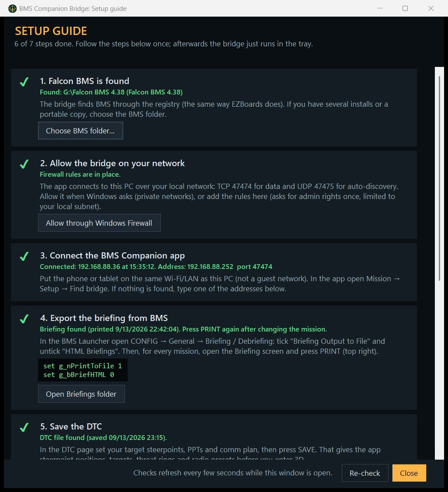

# Mission section setup guide

The Mission section needs the **BMS Companion Bridge** running on the PC that runs Falcon BMS. The bridge reads BMS data locally and serves it to the app over your local network. It sends plain data, never screen captures, so it costs nothing in frame rate.

```
 Falcon BMS ──shared memory──┐
 briefing.txt / DTC .ini ────┤
 Tacview RT stream (42674) ──┼──> BMS Companion Bridge ──LAN (HTTP 47474, UDP 47475)──> BMS Companion app
 EZBoards (on request) <─────┘
```

## 1. Run the bridge

> **Built-in setup guide.** On first launch the bridge opens a step-by-step **Setup guide**. It checks each step live (✔ done · ● to do · ✖ problem): BMS found, firewall, app connected, briefing export settings, DTC saved, AWACS feed config, and EZBoards with the .NET 8 runtime. Its buttons pick folders, add the firewall rules, copy the cfg lines, or open `Falcon BMS User.cfg` in Notepad. Reopen it any time with **Setup guide** in the bridge window or the tray menu, or start `BMSCompanionBridge.exe --guide`. The guide never edits BMS files itself.
>
> 

1. Download `BMSCompanionBridge.exe` from the Releases page and put it anywhere (for example next to your BMS shortcuts). It is a single file with no install and no .NET requirement.
2. Start it. The window shows:
   - **App link:** the PC address(es) the app connects to.
   - **Falcon BMS:** whether BMS is running and whether you are in the UI or in 3D.
   - **Tacview stream:** the AWACS picture feed.
   - **Briefing:** when the briefing was last printed.
   - **EZBoards:** whether the folder is found, and the last run.
3. Windows may ask for network access. Allow **private networks**. You can instead click **Allow through Windows Firewall**, which adds inbound rules for TCP 47474 and UDP 47475 limited to your local subnet (it asks for admin rights once).
4. Closing the window hides it to the tray. Right-click the tray icon to exit. **Start minimized to the tray** keeps it out of the way.

**Try it without BMS:** tick **Demo mode** and press *Save & apply* (or start `BMSCompanionBridge.exe --demo`). You get a synthetic SEAD mission in Hellas with moving traffic.

## 2. Connect the app

1. Put the phone or tablet on the **same network** as the PC. Guest Wi-Fi networks usually isolate devices and will not work.
2. In the app open **Mission → Setup → Find bridge**. One bridge found means it connects immediately.
3. If nothing is found (some routers block broadcasts), enter the IP from the bridge window and port **47474**, then **Connect**.

The header dot turns green (**LINKED**). The app polls only while the Mission screen is open, and the **☀ button** keeps the screen awake.

## 3. Configure Falcon BMS

### Briefing export (briefing, package, loadout, comms, weather)
In the **BMS Launcher → CONFIG → General → Briefing / Debriefing**:

| Option | Setting |
|---|---|
| Briefing Output to File | **ON** (enables the PRINT button) |
| HTML Briefings | **OFF** (the bridge and EZBoards read the text file) |
| Append New Briefings | optional (the newest briefing in the file is used) |

The cfg equivalents are `set g_nPrintToFile 1` and `set g_bBriefHTML 0`. If you use `g_sBriefingsDirectory`, the bridge follows it once BMS is running.

Then, for every mission: finish planning, open the **Briefing** tab and press **PRINT** (top right). The app updates within about a second.

### DTC (steerpoint positions before 3D, targets, PPTs, presets)
In the **DTC** page set your target steerpoints, PPTs and comm plan, then press **SAVE**. This writes `User\Config\<callsign>.ini`.

### Live flight data
Nothing to do. BMS always publishes shared memory, and data appears once you are in 3D.

### AWACS picture (other aircraft)
BMS has a built-in **Tacview real-time telemetry** server. The Tacview program itself is not needed. Add to `User\Config\Falcon BMS User.cfg`:

```
set g_bTacviewRealTime 1     // start the real-time telemetry server
set g_bTacviewAcmi 1         // Tacview ACMI recording (default 1)
// optional:
// set g_nTacviewPort 42674
// set g_sTacviewPassword mypass   (enter the same password in the bridge)
```

- The stream only runs while **ACMI recording is on**. Start it in 3D with the recording key (default **F**) or enable recording in the Launcher.
- Multiplayer: the host decides with `g_bMPTacviewRtAllowedByServer` (default 1).
- By default the map shows everything the stream contains, like a full AWACS picture. Use the **Hostiles** chip on the map to show friendlies only.

### EZBoards (in-cockpit kneeboards)
- EZBoards (by Logic) ships with BMS 4.38 in `Tools\EZBoards` and needs the **.NET 8 runtime** (Console Apps).
- The bridge finds it in the BMS folder automatically. If you keep it elsewhere, set **EZBoards folder** in the bridge and *Save & apply*.
- Workflow: plan → save DTC → PRINT → tap **Boards → Generate kneeboards** in the app. With **Run EZBoards automatically when the briefing is printed**, PRINT alone is enough.
- To see kneeboards in the cockpit, the 3D pilot model must be on (Setup → Graphics → Pilot Model).
- EZBoards' own settings (which pages, which kneeboard slots) are in its `CONFIG_USER.BAT`.

## Troubleshooting

| Symptom | Fix |
|---|---|
| "timed out" / NO LINK | Is the bridge running? Firewall allowed? Same network, not guest Wi-Fi? Try the IP manually. |
| "connection refused" | Nothing listens on the port: the bridge is closed or uses another port (check its window). |
| Briefing tab empty | PRINT not pressed, HTML briefings still on, or the briefing folder is redirected (start BMS so the bridge can read its real path). |
| Steerpoints not on the map before 3D | Save the DTC. In 3D, positions come from shared memory. |
| No AWACS feed | `g_bTacviewRealTime 1`, ACMI recording running, correct port/password in the bridge, MP host allows it. |
| EZBoards fails | Open the log on the Boards tab. Usual causes: .NET 8 runtime missing, briefing not printed, EZBoards folder wrong. |
| Wrong map | The app uses the theater BMS reports. Add-on theaters that reuse a base map show that map. |
| Demo data after testing | Untick Demo mode in the bridge and press Save & apply. |
